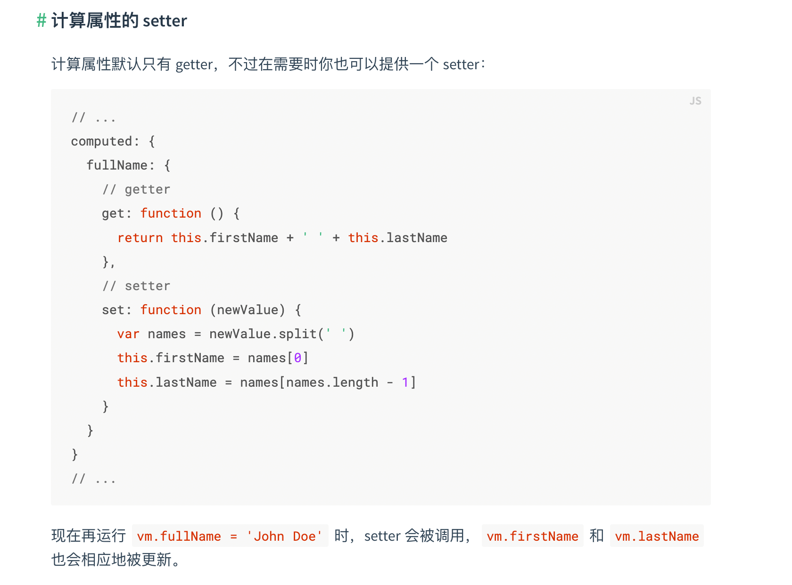

## 准备
- 怎么实现事件委托，通过事件委托怎么实现 vue.self
<!-- 只当在 event.target 是当前元素自身时触发处理函数 -->
<!-- 即事件不是从内部元素触发的 -->

...

项目中一般是怎么做错误监控的
一般怎么看页面性能，有哪些手段，主要看哪些指标，通过这些指标怎么定位问题，根据问题怎么做优化
服务端渲染

- 虚拟列表原理
https://juejin.cn/post/7085941958228574215
虚拟滚动 + 懒加载
计算出可视区域的 startIndex 和 endIndex，只渲染可视区域+buffer区域的内容，可视区域上下的高度一般用padding撑开
监听页面滚动事件，动态改变可视区域的 startIndex endIndex，动态改变padding-top padding-bottom
为了防止滚动白屏，即滚动太快导致的js 计算速度跟不上滚动速度而出现的页面白屏，预留上、下缓冲区域，让用户快速滚动的时候能看到我们预先加载好的内容。
即使有虚拟滚动加载，我们也不能一次请求10w 条数据，这样加载时间会很长，还是要配合懒加载的方式，触底加载数据。

- 高性能表格
https://segmentfault.com/a/1190000039808261
canvas实现表格 渲染快但扩展性不好，如果遇到表格中的自定义内容，图片、按钮等，不好拓展。
所以有这方面要求，还是使用DOM 实现，给每个 div 绝对定位拼凑出表格，这样的前提是：
所有单元格的位置都有提前计算，可以利用 web worker 并行计算。
这样的好处：
1、滚动时，单元格可以最大程度实现复用：如果这个div没有滚出可视区，就不用重新渲染。
2、对于合并的单元格，只会让可视区域渲染的总单元格数更小，更利于性能提升，而不是带来性能负担。
抛弃原生滚动条，而是监听mouse wheel,使用 .scroll 自己实现滚动以及滚动条。
这样的好处：
1、不再需要buffer 区域，因为用 js 控制触发的滚动发生在渲染完成之后，所以浏览器会在滚动发生前现完成渲染，这样就不会出现因为渲染速度跟不上滚动速度导致的白屏问题了。
2、如果是使用原生滚动，横纵轴只能在单元格区域监听滚动后，通过 .scroll 模拟滚动，这必然会导致单元格与滚动轴有一定的错位，即轴的滚动有几秒的错位感，而模拟滚动，轴、单元格区域都使用 .scroll 触发滚动，使得轴和单元格不会出现错位，因为轴和单元格都是用 .scroll 触发的滚动。

- http 缓存，强缓存和协商缓存分别对应什么字段
https://segmentfault.com/a/1190000015245578
https://developer.mozilla.org/zh-CN/docs/Web/HTTP/Headers/Cache-Control

通过 Cache-control 或者 Expire 判断是否命中强缓存，命中的话使用本地缓存资源（Cache-control: 可以设置缓存类型，以及到期时间，Expire设置到期时间，如果两个字段都存在以 Cache-control: max-age=xxx 为准）
如果没有命中强缓存，通过Etag/if-no-match（http1.1中的，http1.0中是 Last-Modified/if-Modified-Since）判断资源有没有被修改过，没有的话服务端返回 304 客户端使用缓存资源，有的话去请求新的资源。
no-store
永远都不要在客户端存储资源，永远都去原始服务器去获取资源。
no-cache
可以在客户端存储资源，每次都必须去服务端做新鲜度校验，来决定从服务端获取新的资源（200）还是使用客户端缓存（304）。也就是所谓的协商缓存。

http1.0 1.1 2.0 3.0
https://mp.weixin.qq.com/s/B7K00-wTUSmy87caDHRWFA
https://www.zhihu.com/question/34074946/answer/75364178?utm_source=wechat_session&utm_medium=social&utm_oi=607614389361315840&utm_content=group3_Answer&utm_campaign=shareopn

vue 中 computed 的作用，可以直接改变计算属性的值吗
vue 路由模式 和 原理

- 什么是单页应用，怎么实现单页应用
https://segmentfault.com/a/1190000019936510

介绍单页应用：页面看起来只有一个，不管点击哪里都不刷新页面
表面可以借助框架实现，原理即路由原理

## 一面
项目
你做的最多的讲一讲
最复杂的讲一讲 前端的工作主要在哪里
编辑器前端主要有什么工作
针对简历：安全问题、修复bug、技术分享、源码贡献

最复杂的参保档案：一个页面左右结构，左边5个tab,tab下面有有一个筛选栏，右边是具体数据列表。5个tab对应分别对应待增员、参保中、待减员、已停保、不参保的人，筛选可以通过各种条件筛选数据。主要功能展示，筛选，每一条数据都有状态变更操作。
- tab，对应的数据后端接口因为某些原因，使用第三方接口拉取人员参保状态比较慢，做了缓存。
- 左侧筛选，很多页面都用了，所以做了抽象，不同的筛选对应的形式不一样，比如：姓名 是一个搜索框，性别：是单选，部门：是select，组件接收要筛选项的名字，以及类型，决定渲染筛选框还是输入框还是单选。还会接收dataList，允许自定义筛选项，比如参保状态：是一个多选，选项只有5个，都是自定义的那么就可以把这5个选项自己传递进去。
- 给待增员的人增员，输入了社保公积金缴费基数后，有个功能是缴费试算，计算出这个人具体缴纳的社保公积金具体多少，由于js计算浮点数的问题，自己实现了精确的加法和乘法。

最多的： 移动端一个我的薪酬页面，里面有四个二级页面，都是和薪酬、社保公积金相关的页面，都是用户看的，主要是展示的功能。复杂在于业务复杂，入口有三个应用的IM消息，app里面的小应用，邮件，五个，根据来源不同要做不同的展示，请求的接口也可能不同。
- 比如邮件进入，由于用户没有登录，请求notoken 的接口，其他地方都是登录的就请求正常的接口。这里除了在具体写每个请求时都走一个统一的判断方法，判断请求哪个接口，还在布局组件里面，配置了不需要登录的组件路由，除了不需要登录的路由进入其他路由都判断是否登录，没有登录自动登录，自动登录失败以及登录后再请求notoken 的接口都会抛出错误，这样就相当于做了兜底，从宏观上有一个把控，哪些组件有不登录就能请求接口的需求，哪些没有。
- 水印 
配置是否需要水印，需要的话所以页面都要有一个基于DOM 的水印
基于第三方的一个生成水印的插件，自己封装了一个生成水印的hooks,一个移除水印的hooks，在需要的地方调用。
- 登录
配置是否需要登录，需要的话每次进入二级页面都要先登录，登录后在二级页面之间跳转不用重复登录。

收获：
如果没有提到过遇到的问题，就具体说一下遇到了什么问题，怎么解决的。然后由解决这些问题，最后复盘，总结，输出（分享、博客），如果有比较大的问题，推动解决。沟通效率：拉会讨论比较快。下次再遇到相似的问题就可以比较快速的解决。

1、移动端布局方案
font-size: 使用 rem 会不会体验不好，会不会出现手机竖屏变横屏字体变大的情况？
rem 在普通屏和二倍屏上有什么不同？
dpr 是什么？

首先明确几个概念：
dp: 设备像素（物理像素）
ppi: 像素密度，每英寸包含的物理像素点的个数
dpr: 设备像素比，物理像素和逻辑像素的比例，比如 iphone6 dpr=2; 设计稿上 750px 对应页面宽度 375px，于是有了 1px 的问题，设计稿上的 1px ，到页面中怎么搞定？
transform: scale(0.5)；
背景图片
box-shadow: 0 0 0 0.5px;

第二个问题：css 中 1px 对应多少物理像素，和 dpr 以及屏幕缩放有关（如果把屏幕放大一倍，1px 对应的实际宽度也会变宽一倍）
rem 是基于根元素的font-size 大小的，一般根元素font-size: 16px; 
所以 1rem 在设备像素比（dpr）不同的屏幕上，物理宽度也不一样；

最后说第三个问题：
对视觉组件种类较多，视觉设计对元素位置的相对关系依赖较强的移动端页面：vw + rem
新闻，社区等可阅读内容较多的场景：px+flex+百分比

- vw+rem
rem 布局的本质是等比例缩放，需要动态改变根元素的font-size，他的缺点就是必须通过js 控制根元素的 font-size,也就是说css 和 js 有一定的耦合性，改变font-size 必须在css代码执行之前。
vw 基于整个视口长度，依赖视口大小而自动缩放，无论视口过大还是过小，它也随着视口过大或者过小，失去了最大最小宽度的限制。

因此先设置根元素字体大小为 （比如 10vw），限制根素的最大和最小font-size，配合body加上最大宽度和最小宽度
然后后面再使用rem布局

- px + flex + 百分比
在新闻，社区等可阅读内容较多的场景直接使用px单位可以营造更好地体验。px方案可以让大屏幕手机展示出更多的内容，更符合人们的阅读习惯。

2、vue 页面上渲染一个对象，给这个对象增加一个key 在页面上会响应式更新渲染吗
看怎么写的，vue2中 obj.a = XXX 直接写入的方式不行，Vue.set() 可以
vue3 也可以

3、vue 组件通讯方式

4、computed 存在的意义 直接修改一个 computed 会怎样

5、移动端软件盘，弹出对页面造成什么影响，比如页面底部有 fixed定位的按钮
可能造成页面的resize 客户端可以设置软件盘弹起是否盖住页面或页面resize，也可以固定外部容器的宽高，这样resize 的时候页面宽高也不会变。
也可能遮挡一些输入框，这时候可以让键盘弹起的时候，需要展示的部分 scrollIntoView
无法自动聚焦唤出软件盘的问题

6、事件委托 ul 500*500  li 5个 10*10 中间有很多空白，怎么知道点了空白还是标签
e.target 获取一些元素属性来判断，比如tag名，或者id

7、v-model 怎么实现的，比如要在一个tab切换的地方使用v-model 绑定怎么实现
model 语法糖，通过 prop 绑定数据，通过 event 绑定事件，比如一个 input 输入框，prop 绑定的数据就是输入框value属性(中的值对应的state)，event 绑定的事件就是输入框的 change 事件，change 触发，拿到event.target.value 去改变 state, 触发 re-render

8、获取对象key的方式，有什么区别
Object.getOwnPropertyNames() 获取一个对象自身所有属性，包括不可枚举的属性（比如自定义一个属性： getFoo: {
    value: function() { return this.foo; },
    enumerable: false
  }）
Object.keys() 获取一个对象自身所有可枚举属性
for in 获取一个对象所有可枚举属性，还包括原型链上的可枚举属性，一般会使用 hasOwnProperty() （指示对象自身属性中是否具有指定的属性）过滤掉原型链上的属性

8、反问
