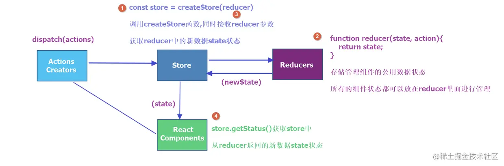

## 准备
border 画三角形
https://segmentfault.com/a/1190000005715074

内联样式和外部样式优先级
捕获和冒泡事件的顺序
https://zh.javascript.info/bubbling-and-capturing

垂直居中和水平居中
行内元素：
text-align: center;
vertical-align: middle;
块级元素：
- flex布局： 主轴对其 justify-content: center;  交叉轴对其：align-items: center;
- position + transform
- margin: 0 auto;

for..in, for..of, forEach和map(forEach, map循环能否中断)
forEach map 只能通过抛出异常的方式中断循环，使用return 不行 (/break/continue 用来中断一个方法，不能用在循环里面)

闭包
应用：函数防抖、节流、单例模式

null/undefined
typeof null  // 'object'
typeof undefined // 'undefined'

h5防止用户缩放 user-scalable="no"
<meta name="viewport" content="width=device-width, initial-scale=1, maximum-scale=1, user-scalable=no">

transition 和 animation
https://blog.csdn.net/gtLBTNq9mr3/article/details/123587378
https://blog.nowcoder.net/n/5d237ab7aa6f4d46b75991ce914948ce

webpack

## 一面
- addEventListener 和 onClick
https://zhuanlan.zhihu.com/p/37268369
onclick 同一时间只能指向一个对象，addEventListener 可以给一个事件注册多个listener,且对于相同的事件处理器不会重复触发，不需要手动使用removeEventListener 清除。
addEventListener 可以给所有DOM 元素注册事件，onClick 只对 HTML 有效

- this、箭头函数的this
在绝大多数情况下，函数的调用方式决定了 this 的值（运行时绑定）。this 不能在执行期间被赋值，并且在每次函数被调用时 this 的值也可能会不同。ES5 引入了 bind 方法来设置函数的 this 值，而不用考虑函数如何被调用的。ES2015 引入了箭头函数，箭头函数不提供自身的 this 绑定（this 的值将保持为闭合词法上下文的值）。

- 讲一下 new 
如果构造函数 return {name: 'lichen'}
new 出来的对象的this 指向
```js
class Fn {
    public name = '';
    constructor(name) {
        this.name = name;
       return { name: 0 };
    }
}
console.log(new Fn('li')); // {name: 0}
```
会指向 **构造函数中返回的值**，当然构造函数的返回必须是一个合法的，比如 Fn 中有一些私有属性，构造函数中不能返回这些私有属性，也不能缺失class 中的属性，这时候就没有一个合法的返回值

- 讲一下 Promise
Promise.all  是所有的都执行正确触发还是无论正确/失败都触发

https://developer.mozilla.org/zh-CN/docs/Web/JavaScript/Reference/Global_Objects/Promise

promise 对象能够拿到一个异步操作成功或者失败的值，一个 Promise 必然处于以下几种状态之一：
待定（pending）：初始状态，既没有被兑现，也没有被拒绝。
已兑现（fulfilled）：意味着操作成功完成。
已拒绝（rejected）：意味着操作失败。

因为 Promise.prototype.then 和  Promise.prototype.catch 方法返回的是 promise，所以它们可以被链式调用。

静态方法： 用 static 关键字声明的，不能使用实例访问，而要用类本身去访问
Promise.all()
Promise.allSettled()
Promise.any()
Promise.race()
Promise.reject()
Promise.resolve()

实例方法：  实例可以访问，每个实例都有，且互不干扰
Promise.prototype.catch()
Promise.prototype.then()
Promise.prototype.finally()


flex布局 默认多行吗
https://developer.mozilla.org/zh-CN/docs/Web/CSS/CSS_Flexible_Box_Layout/Basic_Concepts_of_Flexbox
主轴，交叉轴
flex-direction
flex-wrap
flex-basis 基准值，比如父元素flex 布局,宽度500px，设置子元素1 宽度 100px，那么子元素的flex-basis: 100px，子元素1最小是100px, 其他元素只能分配剩下的400px
flex-shrink
flex-grow
justify-content 主轴对其方式
align-items 交叉轴对其方式

安全漏洞 输入密码验证那块好好说一下

- 事件机制

- react生命周期/react hooks

React.memo() 
useMemo()
useCallback() 作用
父组件更新子组件会不会更新? 
https://juejin.cn/post/7039256825656524807

文中提到的 useMemo，useCallback 优化的效果，同时需要React.memo() 包裹子组件
也就是： 使用 memo 缓存子组件，使用 useMemo 缓存数据， useCallback 缓存方法，避免不必要的渲染。当然缓存也有开销，所以并不是所有地方都是做缓存比不做好。

```js
import React, { useState, memo, useMemo } from 'react'

// 子组件
// function Child({ userInfo }) {
//     console.log('Child render...', userInfo)

//     return <div>
//         <p>This is Child {userInfo.name} {userInfo.age}</p>
//     </div>
// }
// 类似 class PureComponent ，对 props 进行浅层比较
const Child = memo(({ userInfo }) => {
    console.log('Child render...', userInfo)

    return <div>
        <p>This is Child {userInfo.name} {userInfo.age}</p>
    </div>
})

// 父组件
function App() {
    console.log('Parent render...')

    const [count, setCount] = useState(0)
    const [name, setName] = useState('双越老师')

    // const userInfo = { name, age: 20 }
    // 用 useMemo 缓存数据，有依赖
    const userInfo = useMemo(() => {
        return { name, age: 21 }
    }, [name])

    return <div>
        <p>
            count is {count}
            <button onClick={() => setCount(count + 1)}>click</button>
        </p>
        <Child userInfo={userInfo}></Child>
    </div>
}

export default App

```

- 讲一讲 redux，里面有什么基础api


- 讲一讲jest，单元测试有哪些指标
https://juejin.cn/post/7034883735732355079


手写cloneDeep 运行失败了。。

- webpack
怎么配置一个 sass-loader  style-loader 干什么的？ 把 CSS 插入到 DOM 中

babel 原理 具体怎么根据代码转语法树的 怎么根据AST转代码的？ https://zhuanlan.zhihu.com/p/412235767
编译：高级语法 -> 低级语法
转译：高级语法 -> 高级语法

@babel/parser: 词法分析（标记节点，属性，方法） 语法分析（标记之间的关系） Code -> AST （AST 是 Code 的高效表示，更加方便遍历和转译）
@babel/traverse: 转换  根据配置的preset 和 plugin, 遍历preset生成 plugin 的集合，深度优先遍历 AST 按需转译. AST -> AST
@babel/generator: 生成 AST -> Code

output里面的publicPath 干什么的？
publicPath 配置选项在各种场景中都非常有用。你可以通过它来指定应用程序中所有资源的基础路径。比如线上的图片资源，可能都在一个 /img/ 文件夹下面，这时就需要配置图片资源的 publicPath，防止找不到图片 404

## 二面
1、印象最深刻的项目
聊项目 为什么印象深刻，踩坑之后会有积累吗？
项目到app 里面页面打开经历了什么？ 说大概流程（webpack 帮我们做了什么？
项目里面用没有辅助测试工具？ jest 覆盖率怎么样？ jest 怎么测试有ajax请求的地方？ 怎么测试 hooks?
讲了一个c端项目，c 端项目看重性能，项目中有没有做什么保证项目的性能

react 可能是一个父组件 下面一堆子组件，每次解析从上到下，如果中间有个组件报错了就会阻断其他组件解析，这里react 是怎么处理的？
setState() 合并更新，在 react 管不到的地方，比如网络请求回调中，修改 state 这时候也想合并更新要怎么做？

js 新特性了解过吗？ 装饰器，proxy 讲一下，具体举个例子在什么场景会使用？
node 了解过吗？ express 了解一些，读取文件 readFile() readFileAsync() 有什么区别？

css表示红色有几种方法，#fff white rgb() rgba() 有什么区别？
写一个方法 输入 #fff，输出 rgb(255, 255, 255);


function transformColor(color) {
	console.log(parseInt('999'));
	if(typeof color !== 'string') return new Error('输入不合法');
	
	let tempColor = color.slice(1, color.length);
	const length = tempColor.length;
	let result = [];
	
	if(length === 3) {
		result = [tempColor.slice(0,1)+tempColor.slice(0,1),tempColor.slice(1,2)+tempColor.slice(1,2),tempColor.slice(2,3)+tempColor.slice(2,3)];
	}else {
		result = [tempColor.slice(0,2),tempColor.slice(2,4),tempColor.slice(4,6)];
	}
	
	result = result.map((item) => {
		return parseInt(item, 16);
	})
	
	return 'RGB('+result.join(',')+')';
		
}

 
