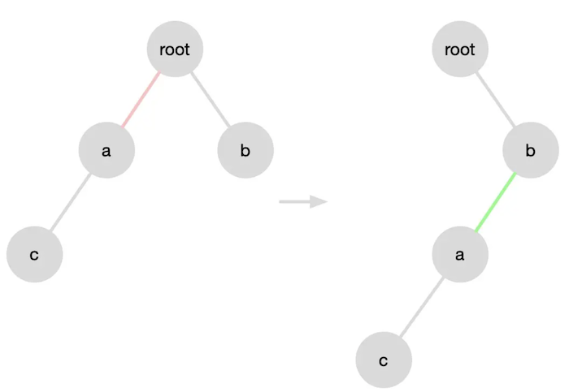
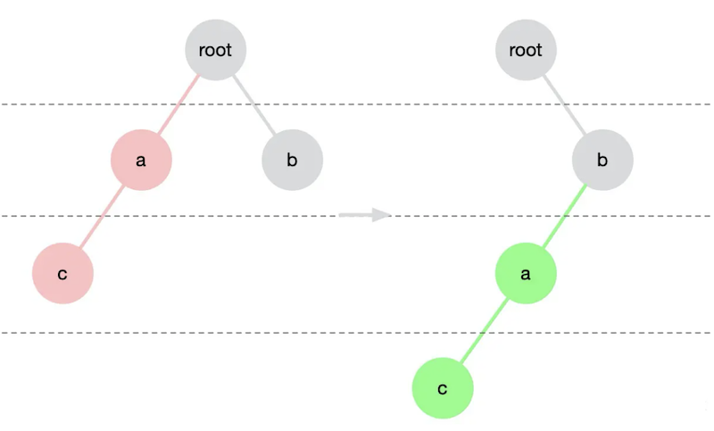
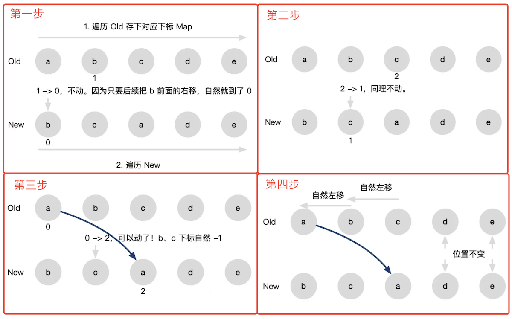
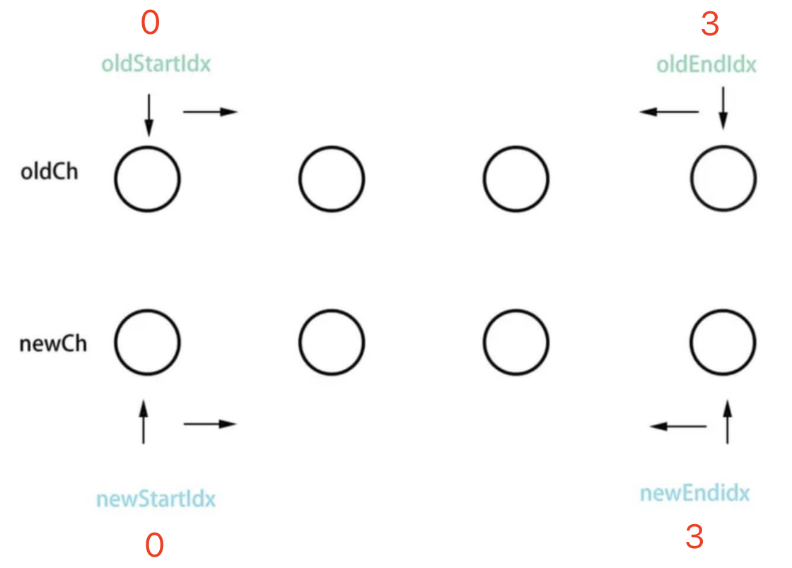
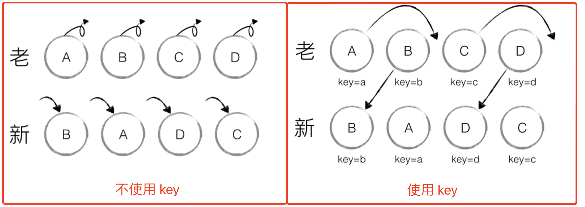

# Vue2 Vue3 React 三者的 diff 有何不同

## diff 算法

diff 算法是一个非常普遍常用的方法，例如提交 github pr 或者（gitlab mr）时，会对比当前提交代码的改动，这就是 diff 。

Vue React diff 不是对比文字，而是 vdom 树，即 tree diff 。<br>
传统的 tree diff 算法复杂度是 `O(n^3)` ，算法不可用。



## 优化

Vue React 都是用于网页开发，基于 DOM 结构，对 diff 算法都进行了优化（或者简化）
- 只在同一层级比较，不夸层级 （DOM 结构的变化，很少有跨层级移动）
- `tag` 不同则直接删掉重建，不去对比内部细节（DOM 结构变化，很少有只改外层，不改内层）
- 同一个节点下的子节点，通过 `key` 区分， 比较子节点时：key 相同移动，key 不同 删除重建

最终把时间复杂度降低到 `O(n)` ，生产环境下可用。这一点 Vue React 都是相同的。




## React diff 特点 - 仅向右移动
比较子节点时，仅向右移动，不向左移动。



举例：
old: [1,2,3,4,5]
new: [2,3,1,4,5]

## Vue2 diff 特点 - 双端比较



定义四个指针，分别比较
- oldStartNode 和 newStartNode
- oldStartNode 和 newEndNode
- oldEndNode 和 newStartNode
- oldEndNode 和 newEndNode

然后指针继续向中间移动，直到指针汇合。
举例：
old: [1,2,3,4,5]
new: [1,2,6,7,4,5]

## Vue3 diff 特点 - 最大递增子序列

在 Vue2 的基础上做了优化

例如数组 `[3，5，7，1，2，8]` 的最长递增子序列就是 `[3，5，7，8 ]` 。这是一个专门的算法。


算法步骤
- 通过“前-前”比较找到开始的不变节点 `[A, B]`
- 通过“后-后”比较找到末尾的不变节点 `[G]`
- 剩余的有变化的节点 `[F, C, D, E, H]`
    - 通过 `newIndexToOldIndexMap` 拿到 oldChildren 中对应的 index `[5, 2, 3, 4, -1]` （`-1` 表示之前没有，要新增）
    - 计算**最长递增子序列**得到 `[2, 3, 4]` ，对应的就是 `[C, D, E]` ，即这些节点可以不变
    - 剩余的节点，根据 index 进行新增、删除

该方法旨在尽量减少 DOM 的移动，达到最少的 DOM 操作。

## 连环问：diff 算法中 key 为何如此重要

无论在 Vue 还是 React 中，`key` 的作用都非常大。以 React 为例，是否使用 `key` 对内部 DOM 变化影响非常大。



```html
<ul>
    <li v-for="(index, num) in nums" :key="index">
        {{num}}
    </li>
</ul>
```

```jsx
const todoItems = todos.map((todo) =>
  <li key={todo.id}>
    {todo.text}
  </li>
)
```
