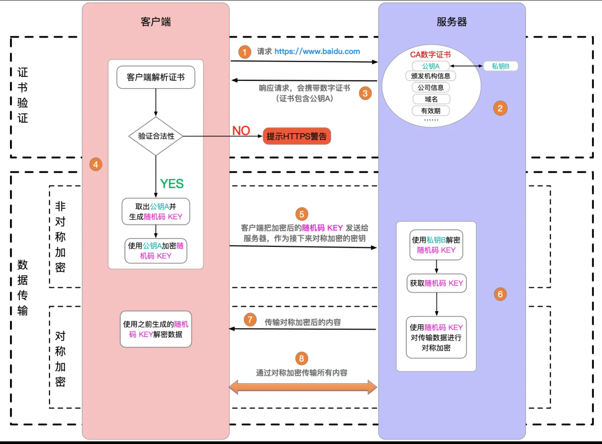
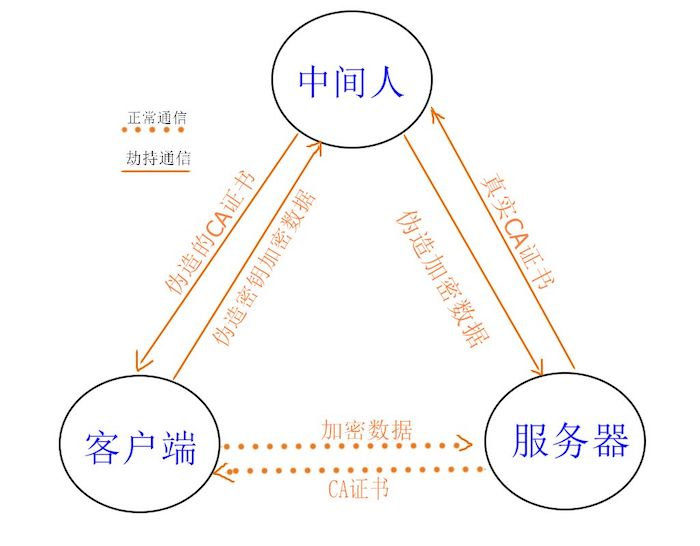
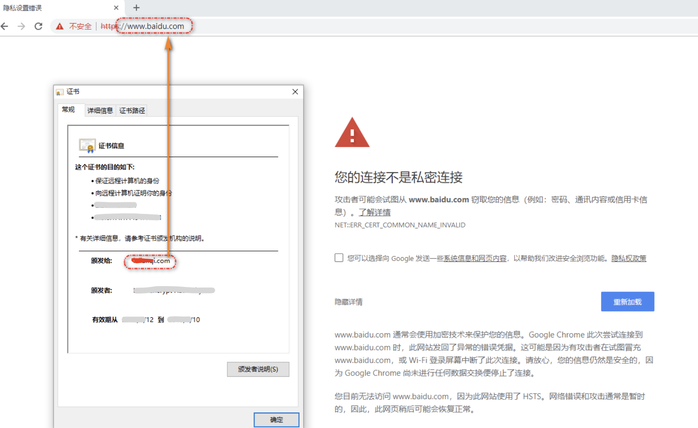

## 什么是中间人攻击

## https

http 是明文传输，传输的所有内容（如登录的用户名和密码），都会被中间的代理商（无论合法还是非法）获取到。

http + TLS/SSL = https ，即加密传输信息。只有客户端和服务端可以解密为明文，中间的过程无法解密。

## 加密方法

### 对称加密
一把密钥 存储在服务端，服务端和客户端传输的密文信息都通过这把密钥加密和解密
优点：简单快速
缺点： 客户端不知道密钥，所以需要服务端在最开始就把密钥给客户端，这就有问题了，服务端把密钥传递给客户端，这中间可能被拦截

### 非对称加密
服务端和客户端都有自己的 公钥和私钥，都是通过公钥加密，然后用自己的私钥可以解密；
所以需要客户端和服务端都分别把自己的公钥传递给对方，让对方用自己的公钥加密信息 传递给自己，只有自己能解密；就算公钥泄漏，别人不知道私钥，也不能解密；
缺点：加密、解密 速度很慢

### 一般采用的加密方式
对称加密和非对称加密结合的方式

非对称加密：服务端有自己的公钥和私钥，把公钥传递给客户端，让客户端通过公钥生成一个key，并加密后再传给服务端，此时服务端可以解密这个key, 客户端也知道 key 是什么，且私钥没有在网络上传输过。

对称加密：此后就用这个 key 进行对称加密传输

## 中间人攻击

上面的对称加密和非对称加密结合的方式看起来如何？其实还有漏洞

如果说客户端和服务端在生成并确认 key 的过程中，被中间人劫持了，中间人也有自己的公钥和私钥，先把服务端传递给客户端的公钥 换成自己的公钥，客户端加密生成key 传递给服务端时，再拦截，解密，就可以知道 key 是什么了

中间人攻击，就是黑客劫持网络请求，伪造 CA 证书。

## 证书

如何预防中间人攻击？

服务端采用正规厂商的证书，正规厂商和浏览器都是有合作的，浏览器会定期从厂商拉取一些信息，浏览器收到服务端的公钥能够识别是不是来自正规厂商的。

解决方案：使用浏览器可识别的，正规厂商的证书（如阿里云），慎用免费证书。

