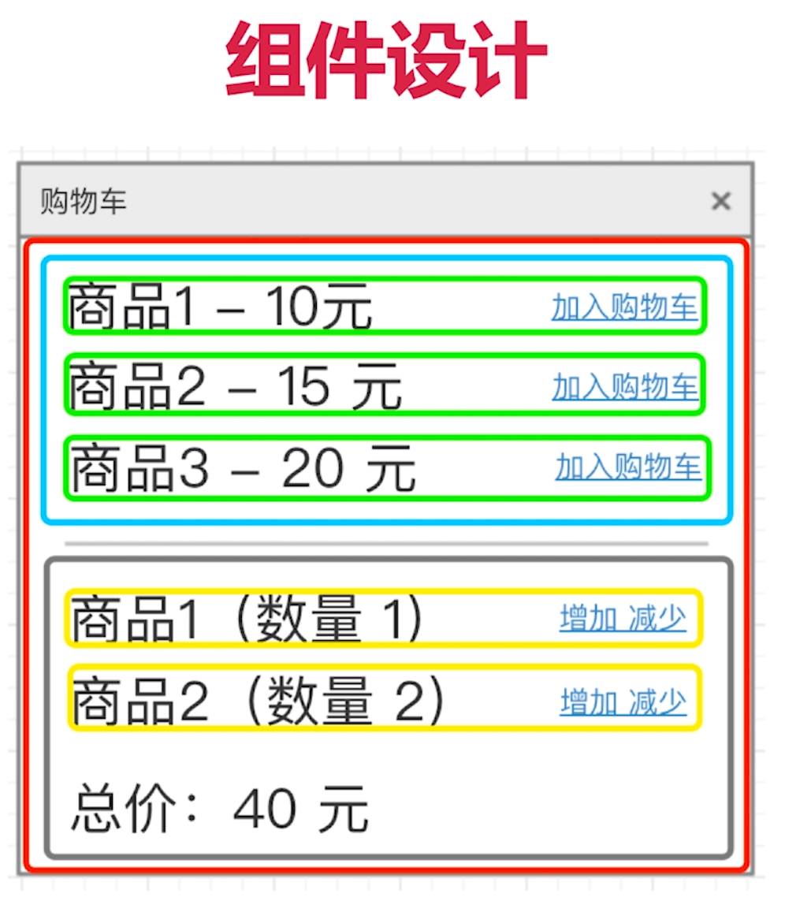

react 实现 todoList

数据设计： 数据结构
可以用数据描述功能
可以遍历和查找
可以扩展

```js
[
    {
        id: 0,
        title: 'todo0',
        computed: true,
    },
    {
        id: 1,
        title: 'todo1',
        computed: false,
    },
]
```
组件设计： 从功能层次上拆分，尽量让组件原子化，容器组件（只管理数据） & UI组件（只管显示视图）
组件通讯

Vue 实现购物车
商品可以在购物车中加入、删除、增加数量、减少数量
展示商品总价

数据结构设计：
```js
{
    productionList: [
        {
            id: 22,
            name: '商品1',
            price: 10,
        },
        // ....
    ],
    cartList: [
        {
            id: 22,
            quantity: 1,
        },
        // ....
    ]
}
// 商品列表 购物车内商品列表
// 购物车里面的商品name, price，都是通过id 在商品列表里面查找

```

组件设计

组件通讯

