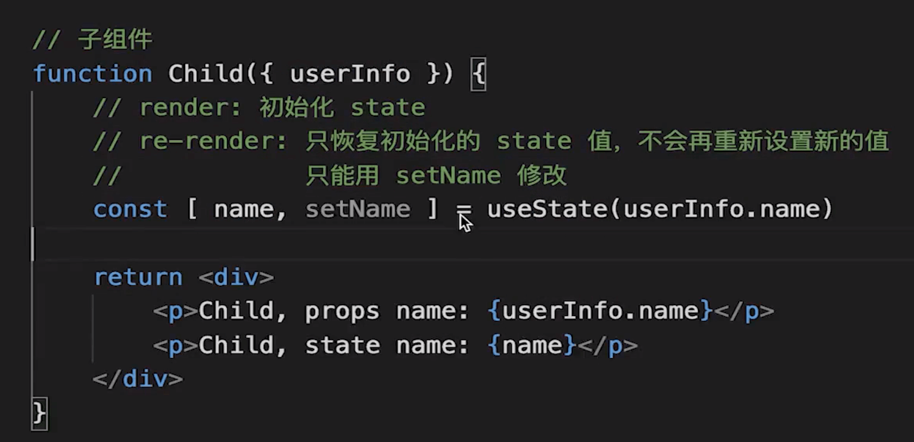

## class 组件的问题
大型组件难以拆分重构，难以测试
逻辑复用复杂 HOC(高阶组件)

## hooks 基本介绍
但函数更加灵活，易拆分，但函数组件的能力还不够，需要加上hooks,规定所以 hooks 都用 use 开头，自定义hook 也用 use开头
useEffect 副作用钩子，组件肯定有副作用所以只靠纯函数肯定不行
useRef: 一个不会触发更新的容器，可以用来获取dom节点，也可以放其他数据
useContext: react context 在hooks 中的应用
useReducer: 更加复杂化的 useState, 使用类似dispatch action 的方式更改state，用于复杂变化的state
是一个单组件状态管理，和 redux 没啥关系，redux是全局状态管理

useMemo 返回一个数据
useCallback 包裹一个方法
都是做性能优化的

## 自定义 hooks
本质是一个函数，函数名以 use 开头，利用 react 封装的 hooks, 自己封装一些通用功能

## hook 使用规范
只能用于函数组件或者自定义hooks中
只能用于顶层代码，不能用在一些循环、条件判断中 为什么？因为hooks 严重依赖于执行顺序，如果hooks出现在一些条件判断、循环里则无法保证其顺序，可能使比如 useState 的值混乱

## hooks 做组件逻辑复用
组件逻辑复用 本身就和hooks 的设计规范一致，hooks 本身就是函数，有明确的变量 作用域，拆分重复逻辑十分方便

## hooks 注意事项
1、useState 初始化值的时候只在 render的时候执行一次，re-render 的时候只是恢复state的值，不会再重新设置
父组件传递过来的 userInfo.name 变了，子组件中的 name 还是原来的值，想修改name的值只能靠setName

2、useEffect 可能出现死循环
比如修改了一个自己监听的 state

## 面试题
- 为什么会有 hooks 他解决了哪些问题
- hooks 有哪些坑
- 如何自定义 hooks
