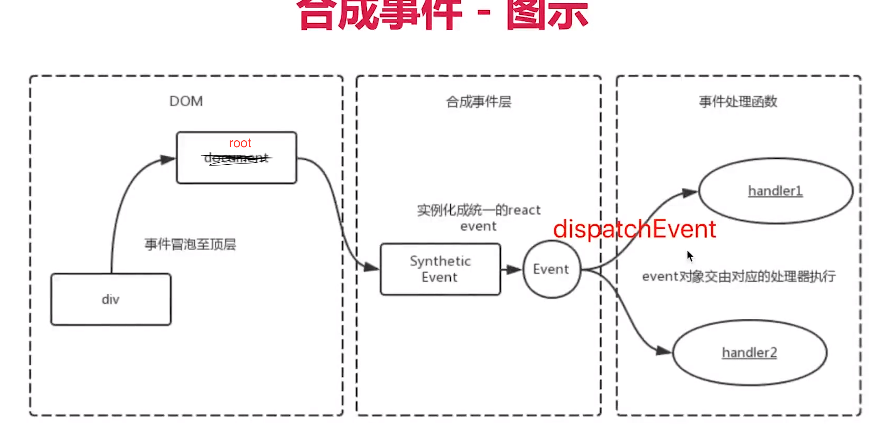
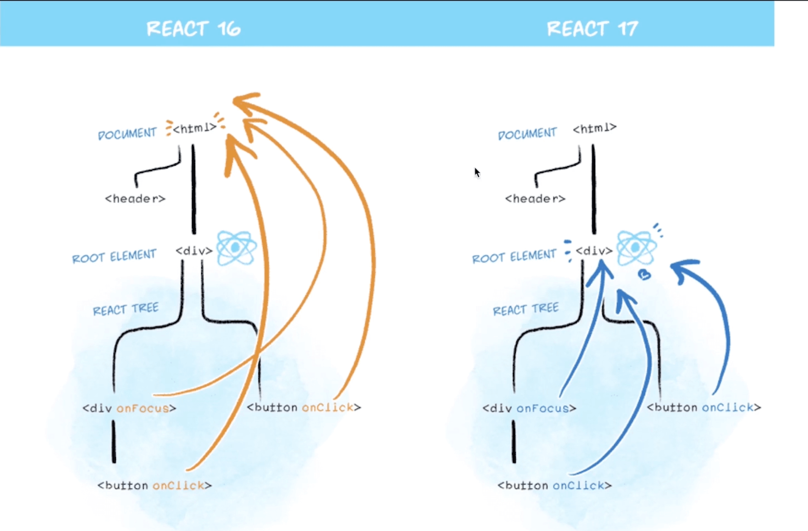
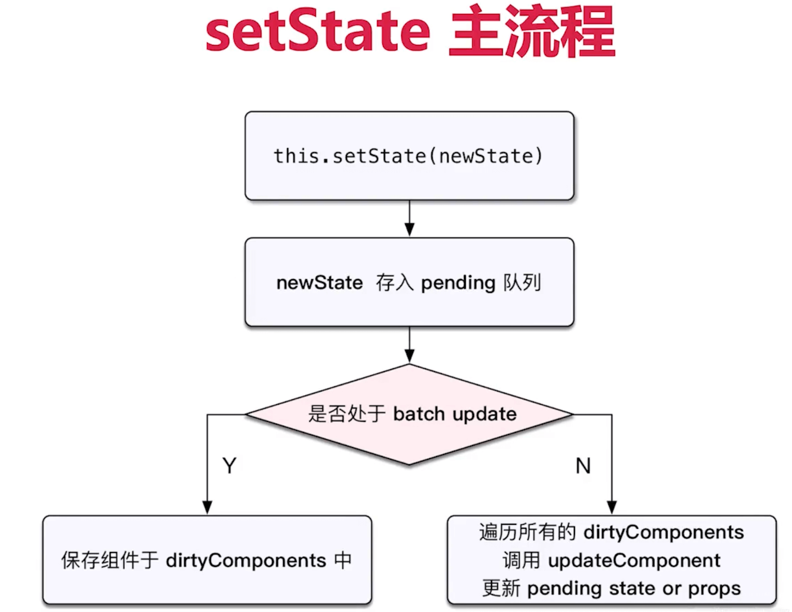
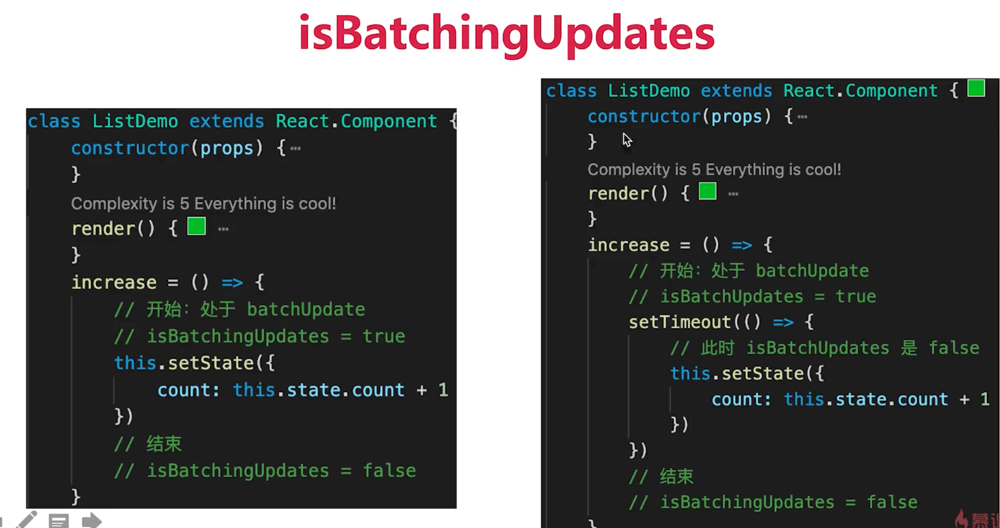
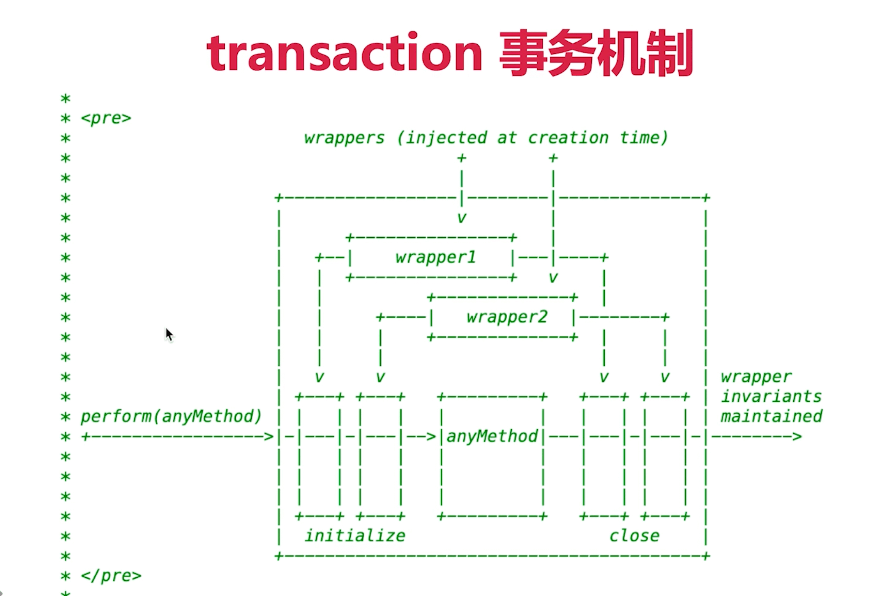

## 函数式编程
## vdom diff

## JSX 的本质
像是 vue 中的 template
Vue template 不是 html 而是 编译出来是 with() 返回 vnode
JSX 也不是 js React.createElement() 返回 vnode

React.createElement(tag, {props....}, child1, child2,...)
第一个参数有可能是html tag，也有可能是组件
React 规定组件名必须大写 用于和 html 元素名区分开

## React 合成事件
所有事件都挂载到 root 上

event 不是原生的，本质是 SyntheticEvent 合成事件对象
和 vue 事件不同，和 DOM 事件也不同

目的：
1、自己实现了一套事件处理机制，最大程度上摆脱了 DOM 事件机制，更好的跨平台和兼容性
2、事件都挂载到 root 上，避免事件的频繁挂载解绑，更优的性能
3、事件都挂载到 root 上，可以统一管理这些事件（事务机制）

## setState batchUpdate
同步：生命周期、合成事件，总之就是 React 可以管到的地方
异步：setTimeout、setInterval、原生 DOM 事件，总之就是 React 管不到的地方 

batchingUpdate

transaction(事务)机制
类似于上面的 isBatchingUpdate 在 React 可以管到的地方,先定义好开始和结束的标志，在事件执行之前先标记开始，执行后标记结束

## 组件渲染和更新的过程
JSX 如何渲染页面
setState 之后如何渲染页面

组件渲染
props state
render() 生成 vnode
patch(elem, vnode)

组件更新
setState(newState) -> dirtyComponent(可能有子组件)
render() 生成 newvnode
patch(vnode, newVnode)

## fiber
https://mp.weixin.qq.com/s/po503V7TTezSVFHqsgoZVw
https://segmentfault.com/a/1190000018250127

patch() 在 React 中被分为两个阶段
- reconciliation  执行 diff 算法，纯 JS 计算
- commit 将vdom 渲染为 dom

可能的问题：
JS 单线程，且和 DOM 渲染共用一个线程，当组件足够复杂，计算和更新的压力都会比较多，这时候如果同时再有 DOM 操作的需求（拖拽，动画），页面将卡顿。

解决： fiber
将 reconciliation 阶段进行任务拆分（commit 阶段无法拆分）时间切片
需要做DOM 渲染时暂停，空闲时恢复
window.requestIdleCallback 可以判断什么时候需要做DOM渲染

