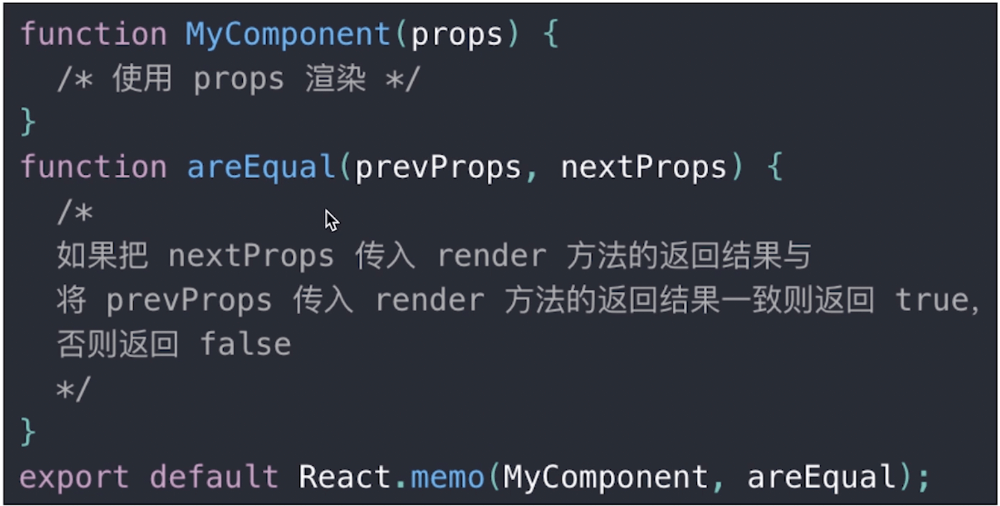
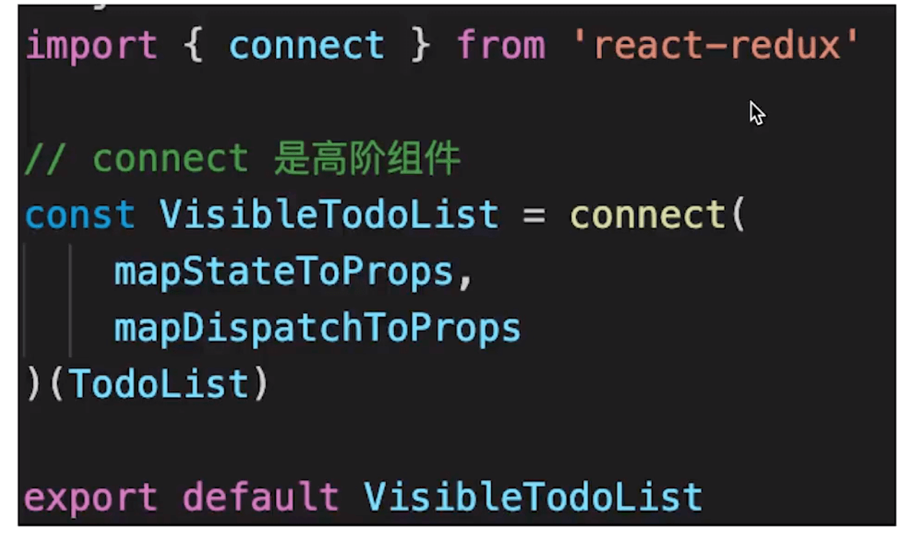
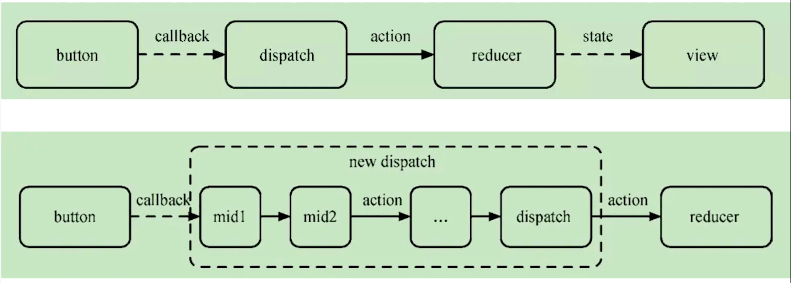

# 基本使用
## JSX 基本使用
变量 表达式
class style
子元素和组件

tips：动态属性
Vue: :  比如: :value=""
React: {}  {}里面是js表达式或变量

## 条件判断
if else
三元表达式
逻辑运算符 && ||

tips：
Vue: v-if v-else
React: 直接使用 if else ...

## 列表渲染
map
key 这个 key 和 vue 中 key 作用一样，必须要有，且不推荐 index 或者 random

tips：
Vue v-for
React: 直接使用 .map .forEach …

## 事件
这是 react 类组件中的一个问题
如果写了一个方法
```js
clickHandler() {
    // 这里拿到的 this 是 undefined，所以需要改变 this 指向
    // 在 constructer() 内或者合成事件中 将方法.bind(this)
    // 在 constructer() 内绑定更好一些，只执行一次，而在合成事件中绑定会执行很多次
    this.setState({...})
}

clickHandler2 = () => {
    // 静态方法 this 指向当前实例
    this.setState({...})
}

clickHandler3 = (event) => {
    event.preventDefault(); // 组织默认行为
    event.stopPropagation(); // 阻止冒泡
    console.log('target', event.target); // 指向绑定元素
    console.log('currentTarget', event.currentTarget); // 指向触发元素


    console.log('event', event); // 注意这里不是原生的 event 而是 react 封装的，可以看到 event.__proto__.constructor SyntheticEvent(组合事件)
    console.log('nativeEvent', event.nativeEvent); // 原生的 event  __proto__.constructor指向 MouseEvent
    console.log('nativeEvent currentTarget', event.nativeEvent.currentTarget); // React17 开始指向 root 节点，有利于多个React 版本并存例如微前端
}

clickHandler4 = (id, name, event) => {
    // 有参数的情况下，event 在最后面默认传递
}
```

## 表单
受控组件 组件的值受 state 数据的控制，比如：textarea、input、select 的 value 绑定一个数据，就成了受控组件
非受控组件

## React 父子组件通讯
props 传递数据
props 传递函数
props 类型检查

useContext

redux

## setState
- 不可变值： 
不能直接修改state, 必须使用 setState
如果涉及到数组的复杂操作，可以先 let newArr = this.state.arr.slice() 复制一下数组再操作
如果涉及到对象的复杂操作 可以使用 Object.assign({}, oldObj, {name: 'ha'})、{...oldObj, name: 'ha' } 保证原数据不变

- 异步更新/同步更新
- 可能会合并更新

## 生命周期
单组件生命周期
父子组件生命周期

React 组件生命周期图示
http://projects.wojtekmaj.pl/react-lifecycle-methods-diagram/

## 函数组件
和类组件的区别

输入 props 输出 JSX
没有实例，没有生命周期


# 高级特性
## 非受控组件
ref
defaultValue、defaultChecked、等属性接受一个 state 当默认值，后面组件的值再怎么变都不会影响state,
后续可以通过 ref 获取 dom 节点，从而获取里面的值

使用场景：
必须操作 dom 的场景，通过 setState 实现不了的
比如： 文件上传 <input type="file">、富文本编辑器，插入一个图片，插入一个下划线，加粗等

受控组件、非受控组件选择：
优先考虑受控组件，因为他是符合 react 设计思想的 数据驱动视图
如果必须操作 dom 考虑非受控组件

## Portals
用于子组件想要逃离父组件的约束的场景（只是渲染的时候逃离，不毁改变组件结构）
比如：
父组件是 BFC（overflow: hidden）, 子组件不想受父组件的限制
父组件的 z-index 值太小
fixed 需要放在 body 第一层级

## context
应用场景： 公共信息（比如：主题，title）传递给每一个子组件，这时候用 redux 有点小题大做，用 props 层层传递又太繁琐
就使用context
```js
// 创建 Context 填入默认值（任何一个 js 变量）
const ThemeContext = React.createContext('light');

// 底层组件 - 函数式组件
function ThemeLink (props) {
    // const theme = this.context // 会报错。函数式组件没有实例，即没有 this

    // 函数式组件可以使用 Consumer 或者 useContext
    return <ThemeContext.Consumer>
        <p>link's theme is {value}</p>
    </ThemeContext.Consumer>
}

// 顶层组件 
class App extends React.Component {
    constructor(props) {
        super(props)
        this.state = {
            theme: 'light'
        }
    }
    render() {
        return <ThemeContext.Provider value={this.state.theme}>
            <Toolbar />
            <hr/>
            <button onClick={this.changeTheme}>change theme</button>
        </ThemeContext.Provider>
    }
    changeTheme = () => {
        this.setState({
            theme: this.state.theme === 'light' ? 'dark' : 'light'
        })
    }
}

```
## 异步组件
import()

```js
const ContextDemo = React.lazy(() => import('./XXXXX'));

render() {
    return <>
        <React.Suspense fallback={<div>loading...</div>}>
            <ContextDemo/>
        <React.Suspense>    
    </>
}

```

## 性能优化
性能优化对react 格外重要

### shouldComponentUpdate 
返回 true 可以渲染，返回 false 不重复渲染

React默认： 父组件更新 子组件也更新,因此 性能优化对 React 格外重要, 我们可以通过 SCU 来避免一些没意义的渲染（函数组件中通过 hooks 控制）

SCU 为什么默认返回 true 或者说这里为何需要自己来做优化，而不是 react 自己来比较 state，相关 state 不变就不更新视图？
因为用户改变 state 不一定按照 react 的规范来更新，比如
```js
    this.state.list.push({
        id: `id-${Date.now()}`,
        title
    })
    this.setState({
        list: this.state.list
    })

    // 这时候再在 SCU 中比对就会觉得 list 没有改变
    shouldComponentUpdate(nextProps, nextState) {
        // _.isEqual 做对象或者数组的深度比较（一次性递归到底）
        if (_.isEqual(nextProps.list, this.props.list)) {
            // 相等，则不重复渲染
            return false
        }
        return true // 不相等，则渲染
    }
```
所以 SCU 必须和不可变值一起使用

### PureComponent React.memo
基于上面的问题 PureComponent 会自动在 SCU 中做一层**浅比较**，浅比较state有变化更新视图，没有变化不更新视图
memo 是函数式组件中的 PureComponent


### 彻底拥抱不可变值 immutable.js
有一定学习成本

## react 高阶组件
抽离组件公共逻辑
- mixin 已经被 react 放弃
- 使用高阶组件 HOC
redux connect 使用了高阶组件

- Render Props

### 扩展 高阶函数
参数值为函数或者返回值为函数。这些函数则称为高阶函数。
比如：柯里化
数组的 map reduce filter 等方法
编写高阶函数，就是让函数的参数能够接收别的函数。

# 周边工具

## redux
### 基本概念
store state
action
reducer

### 单向数据流
dispatch(action)
reducer -> newState
subscribe 触发通知视图层更新

### react-redux
Provider 给父组件注入 store
子组件（以： ComponentExample 为例）中都可以通过 connect()(ComponentExample) 给ComponentExample 注入 dispatch
connect 可以接收一些参数 connect(mapStateToProps, mapDispatchToProps)(ComponentExample),
通过 mapStateToProps 封装一些state 传递给 ComponentExample
通过 mapDispatchToProps 封装一些action 传递给 ComponentExample

### 异步action
同步 action 直接返回 一个 action 对象
异步action 相当于又给action 包了一层 返回一个函数，函数接收dispatch 的参数，便于在异步操作后再通过dispatch 一个action

当然 redux 自己就能支持这种异步action 写法的，要在创建 store 时，引入以下之一中间件
redux-thunk
redux-promise
redux-saga

### 中间件



### 为什么reducer 必须是纯函数
https://juejin.cn/post/6844903729175461902
(浅比较：比较对象存储位置，深比较可能需要深入递归比较，比较耗性能)
### 总结
redux 单向数据流


## react-router
路由模式
hash (默认)
h5 history (更符合 url 规范)

路由配置
- 动态路由

- 懒加载


# 面试题回顾
React 组件如何通讯
JSX 本质
context 是什么有何用途
描述 redux 单向数据流
setState 同步异步
