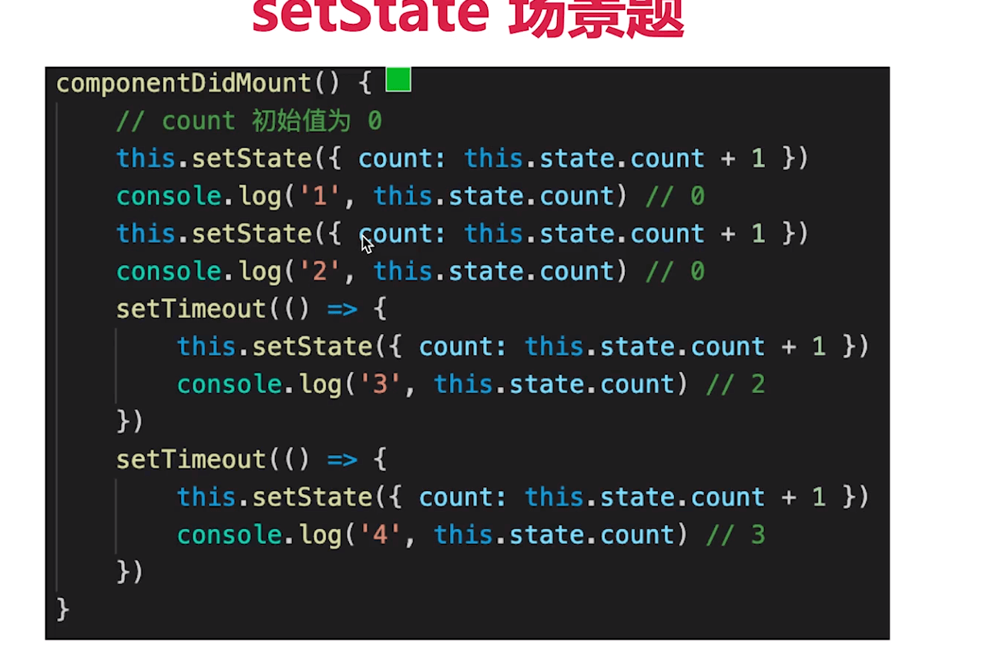
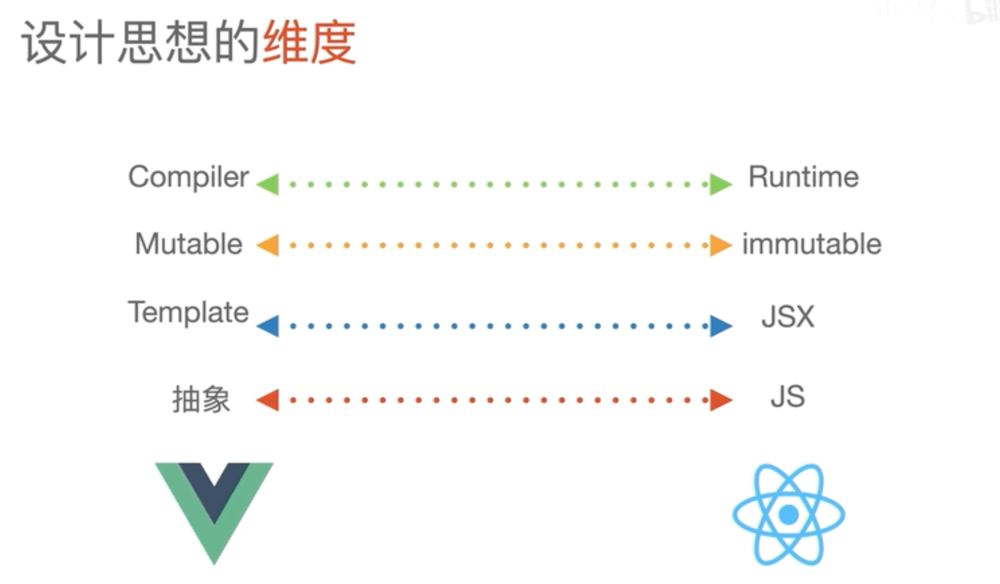

## 组件之间如何通讯
props
context
redux
自定义事件

## JSX 本质

## context 是什么 如何应用

## shouldComponentUpdate 用途

## redux 单向数据流

## setState 场景题

## 什么是纯函数
返回一个新的值，没有副作用（不会偷偷修改其他的值）
不可变值
输入和输出的数据类型相同

## react 发起 ajax 应该放在哪个生命周期
ComponentDidMount

## 渲染列表为什么要 key

## 函数组件和 Class 组件的区别
输入props 输出 JSX,没有实例 没有生命周期

## 什么是受控组件
对比非受控组件

## 什么是异步组件
react.lazy(() => import(XXXX))
 Suspense 组件实现加载中状态

## 多个组件重复逻辑如何抽离
HOC 高阶组件

## redux 如何进行异步请求
使用异步 action
比如 redux-thunk 插件

## react-router 如何配置懒加载

## PureComponent 有何区别
 浅比较的sCU

## React事件和DOM 事件的区别

## React 性能优化
hooks(SCU)
渲染列表使用 key
自定义事件及时销毁
合理使用异步组件
合理使用memo
合理使用 Immutable.js
webpack层面
前端通用

## React Vue 区别

先说相同之处
两个都支持组件化
数据驱动视图 MVVM
都使用 vdom 操作 DOM

1、React 使用 JSX 拥抱 js ，Vue 使用 template 拥抱 html
2、React 函数式编程，改变一个state用 setState(), Vue 声明式编程，改变state data.a = XXX; data.b = XXX;
3、Vue 封装了很多东西更加抽象 compute, watch，指令 v-if v-for，语法受限，标记优化，但React更接近原生
4、React 运行时做了很多计算，所以东西执行的时候diff操作，算出最小的修改路径，导致有可能卡顿所以后来有了 fiber，vue吸收了各家的优点在运行时和预编译之间做了平衡 特别是 vue3 静态标记（标记静态的节点或者属性，diff的时候直接跳过）静态提升（Vue3 中对不参与更新的元素，会做静态提升，只会被创建一次，在渲染时直接复用，每次render直接用不重复创建），按需编译做的很好
5、React 不可变数据（方便时间旅行），计算数据，diff , Vue 可变数据，依赖收集，一个组件一个 watcher

https://juejin.cn/post/7010539227284766751
https://juejin.cn/post/7103060046388396045
https://juejin.cn/post/7082022588326608932

React 是一个重运行时的框架，在数据发生变化后，并没有直接去操作 dom，而是生成一个新的所谓的虚拟 dom，它可以帮助我们解决跨平台和兼容性问题，并且通过 diff 算法得出最小的操作行为，这些全部都是在运行时来做的。

Vue 这个框架，在运行时和预编译取了一个很好地权衡，它保留了虚拟 dom，但是会通过响应式去控制虚拟 dom 的颗粒度（watcher只到组件，组件内部使用虚拟dom），在预编译里面，又做了足够多的性能优化，做到了按需更新（patchflag 再配合 block tree，就可以做到对不同节点的按需更新）。
- patchflag
在 Vue3.0 里面，就有这样一条类似的优化策略，它的 compiler 可以根据节点的动态属性，为每个 虚拟 dom 创建不同的 patchflag，比如说，节点具有动态的 text，或者具有动态的 class，都会被打上不同的 patchflag，精准的标记具体是哪个属性是动态的，这样在进行更新的时候只需要定向查找相应属性的状态。
- block tree
所谓的Block Tree，其实就是把那些DOM结构可能发生改变的地方也作为一个动态节点进行收集。如果属性dynamicChildren有值，则不会执行patchChildren函数进行比较新旧虚拟Node的差异并进行更新。直接比较虚拟Node的dynamicChildren属性对应的元素，就可以完成更新

React ，它本身的思路是纯 JS 写法，这种方式非常灵活，但是，这也使它在编译时很难做太多的事情，像上面这样的编译时优化是很难实现的。所以，我们可以看到 React 几个大版本的的优化主要都在运行时。