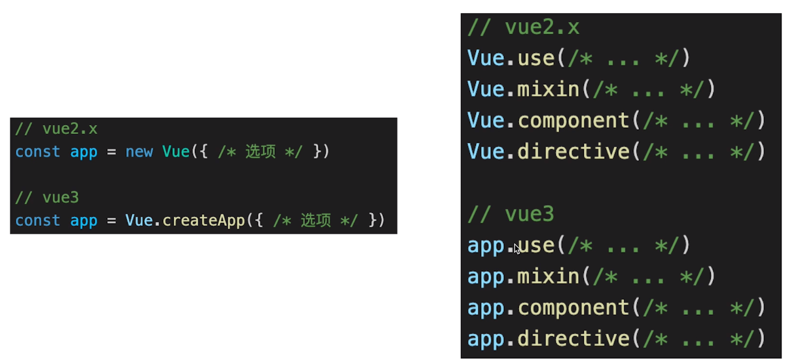
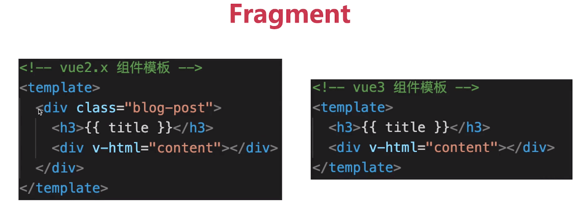
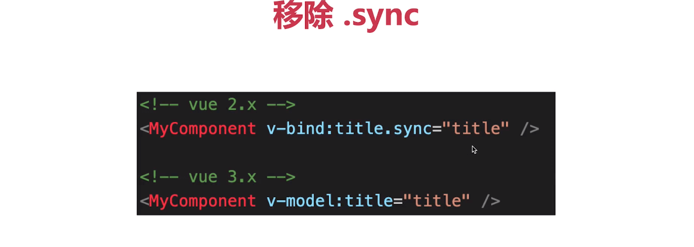
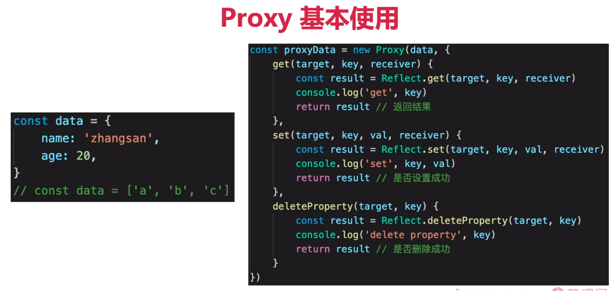

## vue3 和 vue2 相比有什么优势
更好的性能
更小的体积
更好的 ts 支持
更好的代码组织
更好的逻辑抽离
更多新功能

## Vue3 生命周期
- Options API 生命周期
beforeDestroy -> beforeUnmounted
destroyed -> unMounted

- Composition API 生命周期（类似于 react hooks）
setup 相当于 beforeCreate 和 created
```js
import {onBeforeMount, onMounted, onBeforeUpdate, onUpdated, onBeforeUnMount, onUnMounted } from 'vue';
setup() {
    console.log('setup');
    onBeforeMount(() => {
        console.log('onBeforeMount');
    });
    onMounted(() => {
        console.log('onMounted');
    });
    onBeforeUnMount(() => {
        console.log('onBeforeUnMount');
    });
}

```

## ref 为什么需要 .value
- ref 是一个对象，为了不丢失响应式，value 存储值
- 通过 .value 属性的 get 和 set 实现响应式
- 对于 模版 reactive 不需要 .value（vue可以自己控制，模版编译时自己加上 .value），其他情况都需要自己写上 .value

## vue3 升级了哪些重要功能
- createApp

- Fragment

- 移除 .sync 换成 v-model

- ...

## vue3 响应式实现
proxy



**优点** 规避了 Object.defineProperty 的缺点
深度监听性能更好（get 的时候去递归，而不是像vue2 中一样上来就递归，这样的好处是不是一开始就深度监听的，而是获取到哪个层级就深度监听到哪里）
可监听新增、删除属性
可监听数组变化

**缺点**
无法兼容所有浏览器，无法 polyfill
```js
 function reactive(target) {
    if(typeOf target !== 'object' || target == null) {
        return target;
    }

    // 代理配置
    const proxyConf = {
        get(target, key, receiver) {
            // 只处理本身（非原型）的属性
            const ownKeys = Reflect.ownKeys(target);
            if(ownKeys.includes(key)) {
                // 监听
                console.log('get', key);
            }

           const result = Reflect.get(target, key, receiver);
            // 深度监听
            return reactive(result); // 返回结果
        },
        set(target, key, value, receiver) {
            // 已存在的值不重复 set
            if(value === target[key]) {
                return true;
            }
            // 判断是否新增key
            const ownKeys = Reflect.ownKeys(target);
            if(ownKeys.includes(key)) {
                console.log('不是新增');
            }else {
                console.log('新增');
            }

            const result = Reflect.get(target, key, value, receiver);
            return result; // 是否设置成功
        },
        deleteProperty(target, key, receiver) {
            const result = Reflect.deleteProperty(target, key, receiver);
            return result; // 是否删除成功
        }
    }

    const result = new Proxy(target, proxyConf);

    return result;
 }
```
**Reflect** 作用：
和 Proxy 能力一一对应
规范化、标准化、函数式
替代 Object 上的工具函数

## watch 和 watchEffect
两者都可以监听 data 的变化
watch 需要指定具体监听哪个具体的 data
watchEffect 不需要指定需要监听的 data 他会根据内部写的内容自动监听，且初始化时一定会先执行一次，因为要先收集需要监听的数据
```js
watch(
    // 第一个参数 确定监听的属性
    number, 
    // 第二个参数，回调函数
    (oldNum, newNum) => {
        console.log('watch', oldNum, newNum);
    },
    // 第三个参数，配置项
    {
        immediate: true, // 初始化之前就监听
        deep: true, // 深度监听
    }
)

watchEffect(() => {
    // 初始化时，一定会执行一次，因为要先收集需要监听的数据
    console.log('watch effect');
    console.log('number', number); // 自动监听 number
})

```

## 总结
内容较多，因为没用过 vue3 就没怎么看

