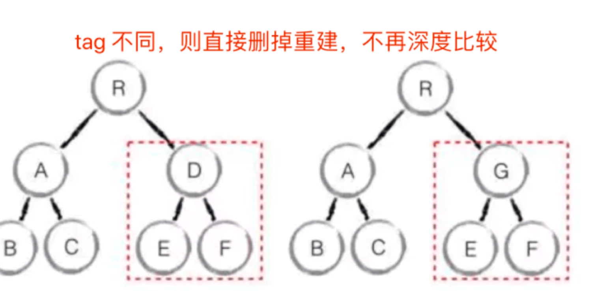
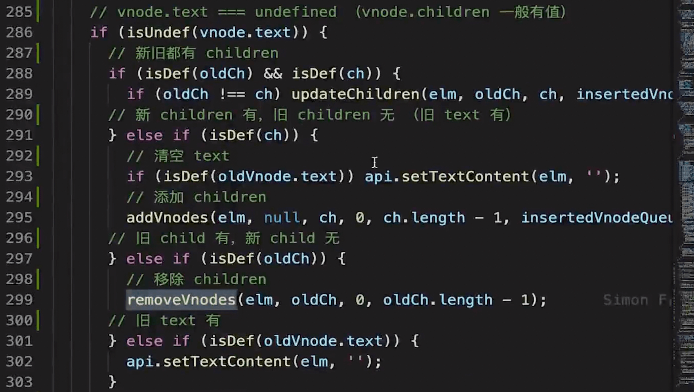
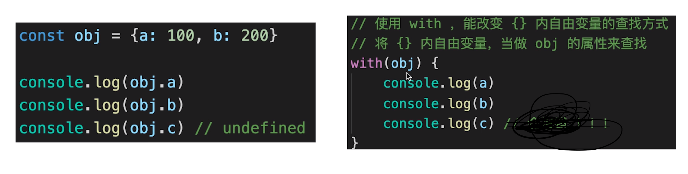
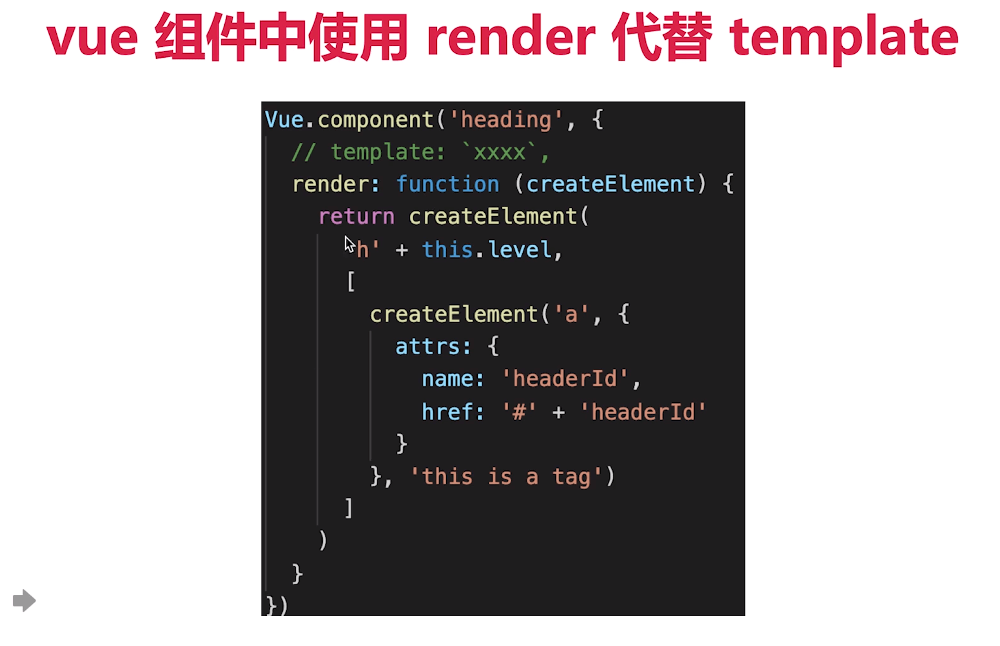
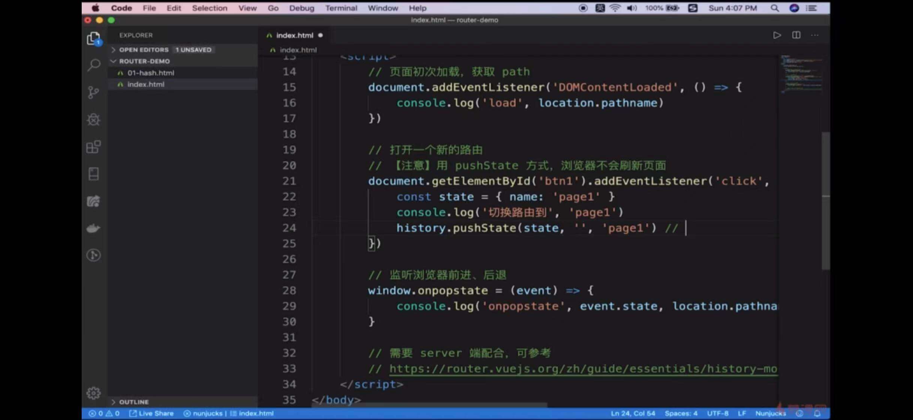
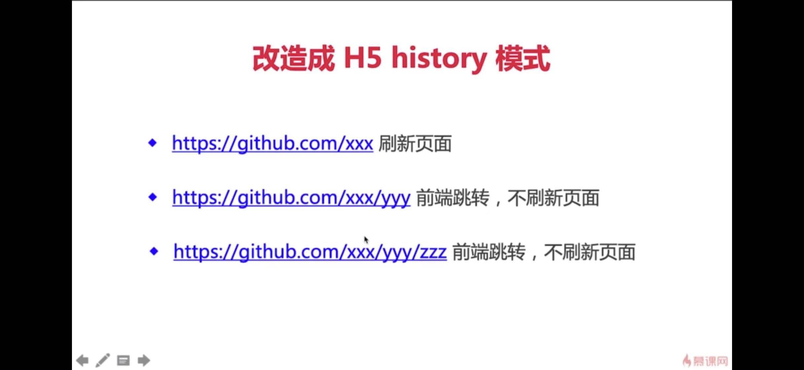

## 组件化基础
传统组件只是静态渲染，更新需要依靠操作 DOM
MVVM 模型在传统组件的基础上做了创新，数据驱动视图，数据视图完全分离

## Vue 响应式更新
核心API Object.defineProperty
```js
// 如何实现响应式
function defineReactive(target, key, value) {
    observer(newValue);

    Object.defineProperty(target, key, {
        get() {
            return value;
        },
        set(newValue) {
            if(newValue !== value) {
                // 深度监听
                observer(newValue);

                value = newValue;
                updateView()
            }

        }
    })
}

// 监听属性
function observer(target) {
    if (typeOf target !== "object" || target === null) {
        // 不是对象或数组
        return target;
    }
    if(Array.isArray(target)) {
        target.__proto__ = arrProto;
    }

    for (let key in target) {
        defineReactive(target, key, target[key]);
    }
}

```
缺点：
- 监听对象，一次性递归到底，一次性需要大量计算
- 无法监听新增删除属性 (Vue.set Vue.delete)
- 无法原生监听数组，需要重写数组的原型(源码中只重写了几个属性)

## 虚拟 DOM
- 背景：
dom 操作非常耗性能

- 解决方案： vdom
js 执行速度非常快，用js模拟dom结构，计算出最小的变更再操作 dom

- js模拟dom结构


- 学习 vdom
参考 snabbdom（vue2 vdom 和 diff算法都参考了snabbdom）  https://github.com/snabbdom/snabbdom

**snabbdom 重点**
h 函数 (返回一个 vnode)
vnode 数据结构
patch 函数 (直接渲染到空的dom元素中，或是更新已有的dom元素)

**vdom**
用js模拟dom结构 (vnode)
新旧 vnode 对比，得出最小的更新范围，最后更新 DOM
数据驱动视图的情况下，有效控制 DOM 操作

## diff 算法
- 概述
diff 即“对比”，diff算法是一个广泛的概念，如Linux diff, git diff等，两颗树之间的 diff 就是 vdom diff
两颗树之间的diff 时间复杂度O(n^3) (第一：遍历tree1，第二：遍历tree2，第三：排序)
- 优化时间复杂度到 O(n)
只做同层比较
tag 不同，直接删除重建

tag 和 key 都相同，认为节点没变，不再深层比较
不传递 key 的情况： `undefined === undefined  // true`

- **patchVnode 函数**
具体的diff实现
根据有没有 text 和有没有 children 进行节点的新增、移除、或是需要进一步比对（updateChildren）

**updateChildren（key 的重要性**
vue2 是定义四个指针（oldStartIdx,oldEndIdx,newStartIdx,newEndIdx）进行双端比较
节点相同执行 patchVnode ，并更新指针位置
如果前前、前后、后后、后前 四种情况都没比对上，就拿新的vnode 的 key 去 旧的vdom 中找有没有 key 相同的
有相同 key 移动节点，没有相同 key 新建节点


## vdom 和 diff 总结
细节不重要，updateChildren 的详细过程也不重要，说个大概就行，不要深究
vdom 核心很重要: h、vnode、patch、diff、key等
vdom 存在的价值更重要，数据驱动视图，控制 DOM 操作的次数

## 模版编译
template 里面的内容不是 html,里面有插值、有指令、有js表达式
- 前置知识 js 的 with 语法
with 语法在日常开发要慎用，因为他打破了作用域的规则，不利于阅读理解


- 编译template
编译template生成 render() , 执行 render 函数返回一个 vnode


_c：createElement
_s: toString()
类似于 snabbdom 中的 h 函数


- vue 组件可以使用render 代替 template
vue组件中，某些特别复杂的情况不能使用 template，这时候可以考虑用 render 的写法


- 总结
编译template生成 render() , 执行 render 函数返回一个 vnode
基于 vnode 可以执行 patch 和 diff
使用 webpack vue-loader 可以在开发环境下编译模版（重要），也就是到线上已经没有template模版了
vue 组件可以使用render 代替 template

## vue-router
- hash
onhashchange
利用一个 # 分割

- h5 history
history.pushState() window.onpopstate()
用 url 规范的路由，但跳转时不刷新页面



## 面试题
- 组件 渲染/更新 过程
一个组件到页面，修改 data 触发更新的过程

**回顾学到的知识**
响应式 监听data属性, getter 和 setter(包括数组)
模版编译： 模版到render() 再到 vnode
vdom: patchVnode(elem, vnode) / patchVnode(vnode, newVnode) 

**拆解问题**
- 初次渲染


- 更新


- 异步渲染


