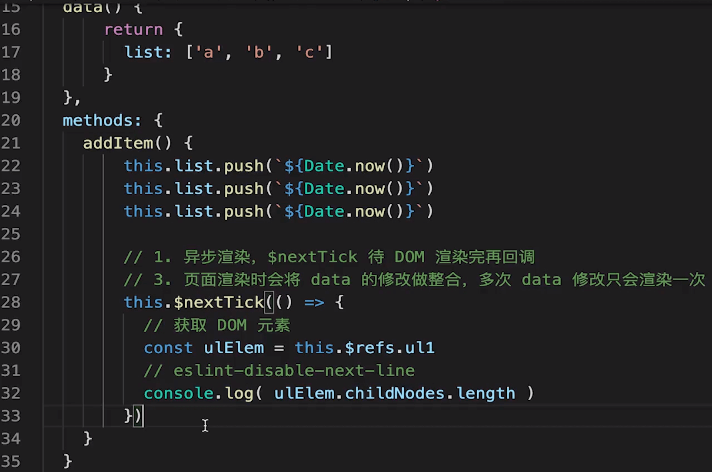
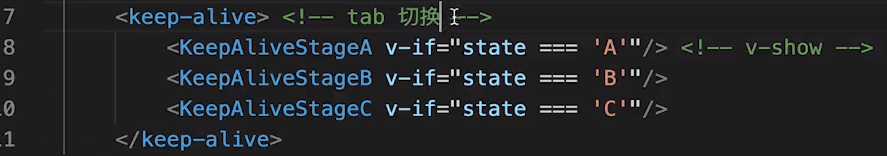
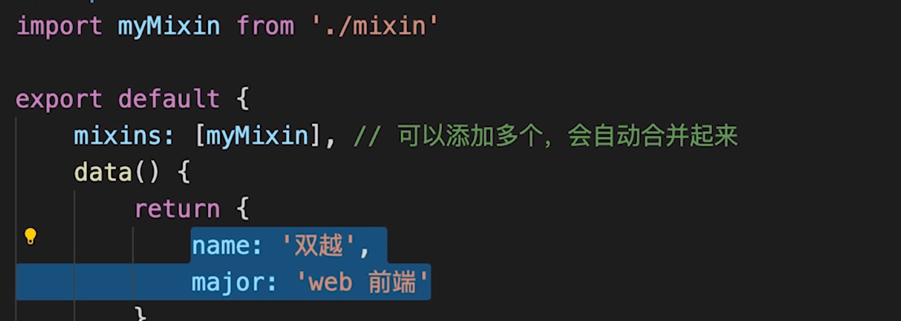
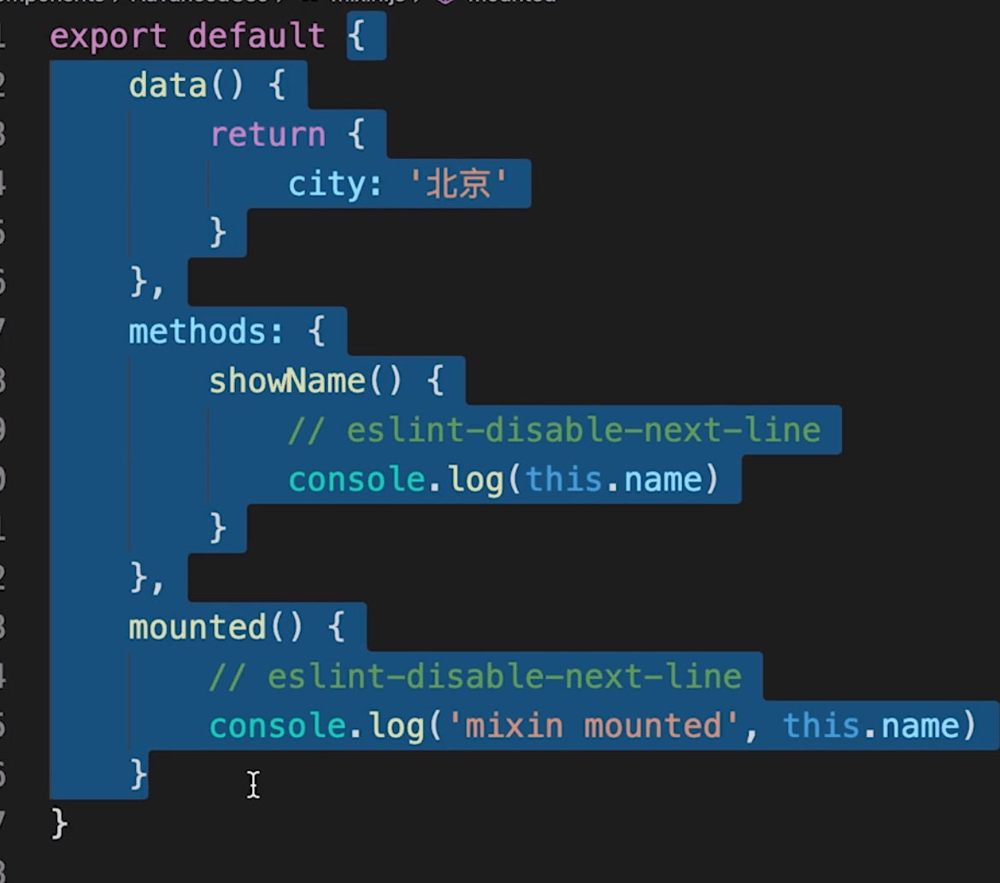
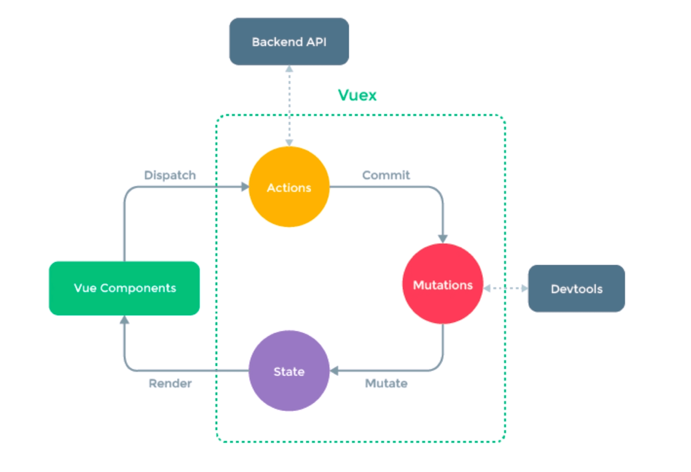

## 基本使用
### watch 如何深度监听
deep: true
- 监听引用类型拿不到 oldValue

### v-if v-show 的区别
### 为何 v-for 中要使用 key

### 循环（列表）渲染
- 使用 v-for 可以遍历数组，也可以遍历对象
- 一定要有 key，key 不要乱用，不要写 random 或者 index，尽量是与业务相关的一个 id
- v-for 和 v-if 不要一起用, 因为 v-for 比 v-if 优先级高
比如
```js
<li v-if="flag" v-for="(val, key, index) in listObj" :key="key">
    {{val.name}}
</li>
```

### 事件
vue2 事件是原生事件，且被挂载到当前元素身上

vue 事件修饰符

按键修饰符


### vue组件
- 组件通讯
- 组件生命周期
- mounted 和 created 的区别
- beforeDestroy 里面要干嘛
- 涉及到父子组件的时候，父子组件谁先挂载，谁先更新，谁先销毁
-----parent beforeCreate-----
-----parent created-----
-----parent beforeMount-----
-----child beforeCreate-----
-----child created-----
-----child beforeMount-----
-----child mounted-----
-----parent mounted-----

-----parent beforeUnmounted-----
-----child beforeUnmounted-----
-----child unmounted-----
-----parent unmounted-----

### vue 表单

## vue高级特性

### 自定义 v-model 
用途： 比如 颜色选择器，自定义 v-model 数值和颜色的双向数据绑定
model: {
    prop: 'text1',
    event: 'change1',
}

### $nextTick
1、为什么会有这个，因为 vue “异步”渲染，改完 data 后不会立即渲染 dom
在改完 data 后也不能立即拿到最新的 data, 如果想拿最新的 data  可以在 this.$nextTick(() => {}) 回调中
2、this.$nextTick(() => {}) 回调，dom渲染完之后立即调用
3、页面渲染时会将 data 的修改做整合，多次 data 修改只渲染一次

### slot
- 基本使用
- 作用域插槽 
父组件使用子组件的data，传递到子组件插槽中
```js
// 父组件
<template v-slot="slotProps">
    {{slotProps.XXX...}}
</template>
```
父组件


子组件

- 具名插槽

### 动态组件
使用： <component :is="" />


is 绑定的 data 值对应着一个组件的名字，比如上面的 NextTickName 对应 NextTick 组件

### 异步组件
import() 函数
异步加载大组件


### keep-alive
缓存组件
用于频繁切换组件，不需要重复渲染


### mixin
多个组件有相同逻辑，抽离出来
mixin 并不是完美的解决方案，会有一些问题
vue3 提出的 composition API 旨在解决这些问题

使用


// mixin.js


问题：
- mixin 和 组件之间可能出现多对多关系，复杂度很高
- 变量来源不明确，不利于阅读
- mixin 内 data 可能会冲突，出现覆盖的情况

## vueX
- 基本概念
state
getters
action
mutation
- 用于 vue 组件
dispatch
commit
mapState
mapGetters
mapActions
mapMutations


## vue-router
- 路由模式
hash 
h5 History
- 一些配置
动态路由

懒加载


