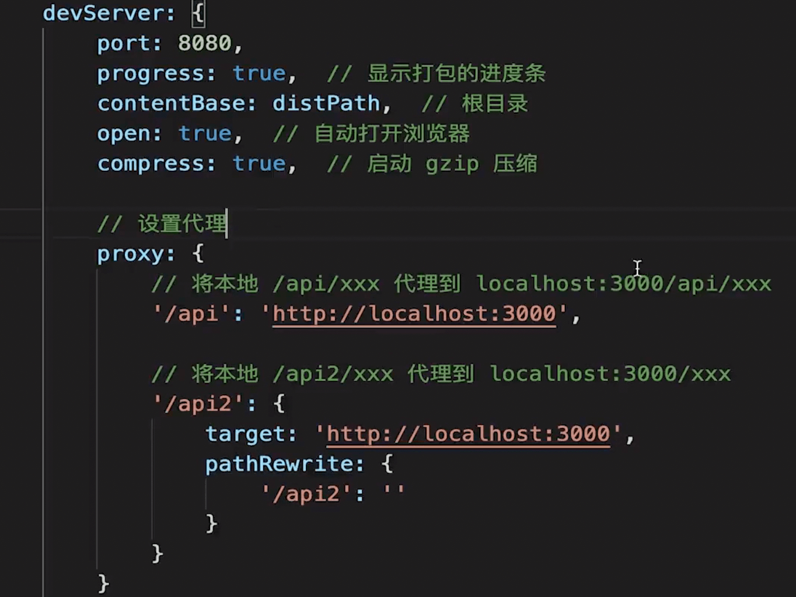
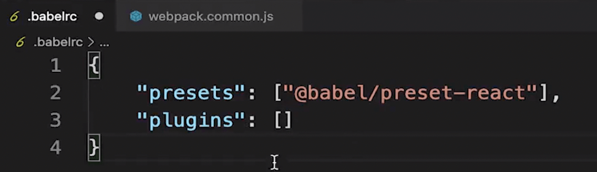

## 基本配置
- 拆分配置 和 merge  安装 
```js
import { smart } from 'webpack-merge';

webpack.common.js
webpack.dev.js
webpack.prod.js

```
- 启动本地服务
开发环境下，需要启动本地服务，安装 webpack-dev-server，在 devServer 下配置，
一般会配置 端口，是否自动打开浏览器，以及遇到跨域问题配置 proxy 代理


- 处理 es6 、 css、图片
module.rules 下面使用 babel-loader 处理 js 文件

```js
module: {
    rules: [
        {
            test: /\.js$/,
            loader: ['babel-loader'],
            exclude: /node_modules/,
        }, 
        {
            test: /\.css$/,
            // loader 执行顺序 从后向前，
            loader: ['style-loader', 'css-loader', 'postcss-loader'],
            exclude: /node_modules/,
        },
        // 图片 - 考虑 base64 编码的情况
        {
            test: /\.(png|jpg|jpeg|gif)$/,
            use: {
                loader: 'url-loader',
                options: {
                    // 小于 5kb 的图片用 base64 格式产出
                    // 否则，依然延用 file-loader 的形式，产出 url 格式
                    limit: 5 * 1024,

                    // 打包到 img 目录下
                    outputPath: '/img1/',

                    // 设置图片的 cdn 地址（也可以统一在外面的 output 中设置，那将作用于所有静态资源）
                    // publicPath: 'http://cdn.abc.com'
                }
            }
        },
        // postcss-loader 处理css 浏览器兼容性 ，比如给一些属性加 -webkit- 前缀
        // css-loader 解析 css 文件
        // style-loader 把 css 插入到 html 中
    ]
}
```

- 配置多入口
入口：多个入口
生成 html 文件的plugin，（针对每个入口都生成一个 HTMLWebpackPlugin 实例）
出口：fieldName 不能写死，要写一个动态的

```js
    entry: {
        index: path.join(srcPath, 'index.js'),
        other: path.join(srcPath, 'other.js')
    },

    plugins: [
        // new HtmlWebpackPlugin({
        //     template: path.join(srcPath, 'index.html'),
        //     filename: 'index.html'
        // })

        // 多入口 - 生成 index.html
        new HtmlWebpackPlugin({
            template: path.join(srcPath, 'index.html'),
            filename: 'index.html',
            // chunks 表示该页面要引用哪些 chunk （即上面的 index 和 other），默认全部引用
            chunks: ['index']  // 只引用 index.js
        }),
        // 多入口 - 生成 other.html
        new HtmlWebpackPlugin({
            template: path.join(srcPath, 'other.html'),
            filename: 'other.html',
            chunks: ['other']  // 只引用 other.js
        })
    ]

    output: {
        // filename: 'bundle.[contentHash:8].js',  // 打包代码时，加上 hash 戳
        filename: '[name].[contentHash:8].js', // name 即多入口时 entry 的 key
        path: distPath,
        // publicPath: 'http://cdn.abc.com'  // 修改所有静态文件 url 的前缀（如 cdn 域名），这里暂时用不到
    },
```

- css 文件的抽离和压缩
在开发环境 css 的配置可以使用上面的，自己电脑配置高一些或者开发环境慢一些也没关系
但生产环境需要把 css 文件 抽离出来 并 压缩
```js
    // 抽离 css
    {
        test: /\.css$/,
        loader: [
            MiniCssExtractPlugin.loader,  // 注意，这里不再用 style-loader
            'css-loader',
            'postcss-loader'
        ]
    },

    plugins: [
        new CleanWebpackPlugin(), // 会默认清空 output.path 文件夹
        new webpack.DefinePlugin({ // 这个插件用来定义全局变量，在webpack打包的时候会对这些变量做替换。在需要根据开发模式与生产模式进行不同的操作时，非常有用
            // window.ENV = 'production' 
            ENV: JSON.stringify('production')
        }),

        // 抽离 css 文件
        new MiniCssExtractPlugin({
            filename: 'css/main.[contentHash:8].css'
        })
    ],

    optimization: {
        // 压缩 css
        minimizer: [new TerserJSPlugin({}), new OptimizeCSSAssetsPlugin({})],
    }
```

- 抽离公共代码
第一个文件引入了 A 文件，第二个文件也引用了 A 文件，打包的时候不能打包重复的东西，而是要把公共的部分抽离出来，让他们都去引用公共部分。或者是一个比较大的第三方包 比如：lodash 一般也单独打包

如果不抽离：比如一个文件中引入了 lodash, 改了一点业务代码, 导致 output 文件的 hash 值变化，重新打包，也会重新打包 lodash 就会比较慢，这样是不行的，但开发环境下无所谓，我们只要构建速度快一些就行，不需要拆分、合并、压缩、分析等操作。

```js
    entry: {
        index: path.join(srcPath, 'index.js'),
        other: path.join(srcPath, 'other.js')
    },

    plugins: [
        // new HtmlWebpackPlugin({
        //     template: path.join(srcPath, 'index.html'),
        //     filename: 'index.html'
        // })

        // 多入口 - 生成 index.html
        new HtmlWebpackPlugin({
            template: path.join(srcPath, 'index.html'),
            filename: 'index.html',
            // chunks 表示该页面要引用哪些 chunk （即上面的 index 和 other），默认全部引用
            chunks: ['index', 'vendor', 'common']  // 要考虑代码分割
        }),
        // 多入口 - 生成 other.html
        new HtmlWebpackPlugin({
            template: path.join(srcPath, 'other.html'),
            filename: 'other.html',
            chunks: ['other', 'common']  // 考虑代码分割
        })
    ],

    optimization: {
        // 压缩 css
        minimizer: [new TerserJSPlugin({}), new OptimizeCSSAssetsPlugin({})],

        // 分割代码块
        splitChunks: {
            chunks: 'all',
            /**
             * initial 入口 chunk，对于异步导入的文件不处理
                async 异步 chunk，只对异步导入的文件处理
                all 全部 chunk
             */

            // 缓存分组
            cacheGroups: {
                // 第三方模块
                vendor: {
                    name: 'vendor', // chunk 名称
                    priority: 1, // 权限更高，优先抽离，重要！！！ 一个文件可能同时命中两个分组 chunk, 要打包到哪个 chunk 中去
                    test: /node_modules/, // 判断是否命中这个分组
                    minSize: '3kb',  // 大小限制 小于 3kb 的文件不单独抽离，文件比较小单独抽离出去反而浪费性能
                    minChunks: 1  // 最少复用过几次，一般第三方模块出现一次就抽离出去
                },

                // 公共的模块
                common: {
                    name: 'common', // chunk 名称
                    priority: 0, // 优先级
                    minSize: '3kb',  // 公共模块的大小限制
                    minChunks: 2  // 公共模块最少复用过几次
                }
            }
        }
    }
```

chunk 代码块
生成 chunk 的地方： entry  splitChunks.cacheGroups  异步加载的js
使用 chunk 的地方： HTMLWebpackPlugin 配置中

- 异步加载 js (懒加载)
webpack 默认支持 import() 语法
```js
import('./async-data.js').then((res) => {
    // ....
})
```

- 处理 .vue 文件，处理 JSX

处理 JSX 使用 babel 就可以了
.babelrc 中配置


处理 vue 文件 使用对应的 loader
```js
module: {
    rules: [
        {
            test: /\.vue$/,
            loader: ['vue-loader'],
            include: srcPatch,
        }, 
    ]
}
```

- module bundle chunk 
https://juejin.cn/post/6844903889393680392
module: webpack 中一切皆模块，也就是说我们写的能被引用分析的源码文件都是 module
bundle: 多个模块合成的，如：entry import() splitChunks 都能生成 bundle
chunk: 最终的输出文件
