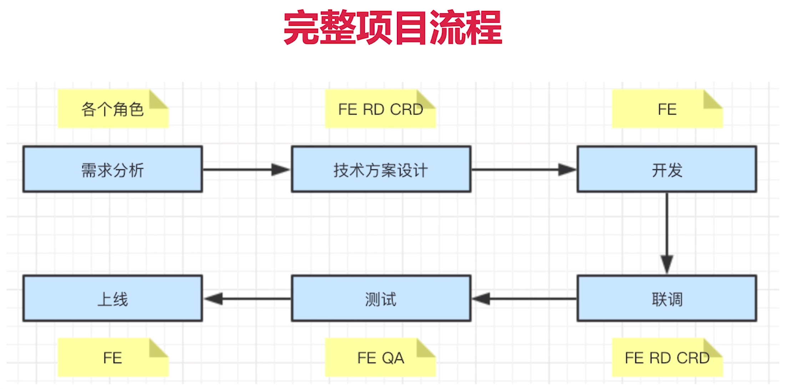

项目分多人、多角色参与
项目分多阶段
项目需要计划和执行

项目整体流程

1、需求分析
了解背景
质疑需求设计是否合理
需求是否闭环（是否考虑全面了，比如有个新闻 pm想要加个点赞功能，点赞完新闻需要按照点赞数量排序吗？）
开发难度如何
是否需要其他支持 （如果需要别人的支持，看看别人什么时候有时间）
不要急于给排期 （要综合来看，UI设计什么时候出，自己是不是还有其他的任务，有没有历史可能有坑的代码，预留buffer）

2、做好技术方案设计
求简，不要过度设计
产出文档，有文字，有完整流程图，避免眼高手低，如果一个认为简单的需求，文档应该很快半小时就写完了。
找准设计重点（路由设计，组件设计，组件通讯，和其他角色怎么对接（后端、移动端、UI））
设计评审（一是组内大佬经验丰富可以看出很多自己看不出的东西，同时是很好的学习机会，二是老的成员可能知道很多历史逻辑，一些公共工具，坑，需要注意的点）
和 RD CRD 沟通（达成一致）
发出会议结论（邮件或者聊天，留下证据，防止甩锅）

3、开发
如何保证开发质量？
排期：预留buffer 大概 1/4 的时间，考虑自己是否有并行工作，考虑协同人的排期比如UI排期，后端排期
符合开发规范：git 规范，命名规范，注释规范，一定符合规范，不要图快图省事，规范一般部门都有，如果没有可以制定一个，这是一个很好的表现机会
写出开发文档：如果做的东西是公共的，一定要写好开发文档，或者完备的注释，怎么调用，什么功能
及时单元测试：
Mock API：
及时 Code Review: 

4、联调
和 RD CRD 联调
让 UE 确定视觉效果
让 PM 确定功能

如果 PM 加需求怎么办？
不能拒绝，走需求变更流程即可
如果公司有流程，按流程走，否则发起项目组和leader 评审，重新评估排期（总之通相关成员和双方leader）

5、测试
发提测邮件，抄送项目组
测试问题要详细记录（测试问题管理平台比如：jira）
及时沟通问题，防止信息不对称

我电脑没问题？
当面沟通，让QA帮忙复现
可能需要特定设备，借设备复现问题

6、上线
及时通知 QA 回归测试
及时通知 PM 验证功能
有问题回滚，及时止损，再分析排查问题

沟通
沟通是最重要的，比写代码更重要
每日一沟通（站会），有事说事，没事报平安
尽早识别风险，抛出风险（比如UI设计图没有及时给出，今天不给，我这边大概率开发不完了，压力给到UI，如果要延期，让UI去协调，不要让问题出现在自己负责的阶段）

